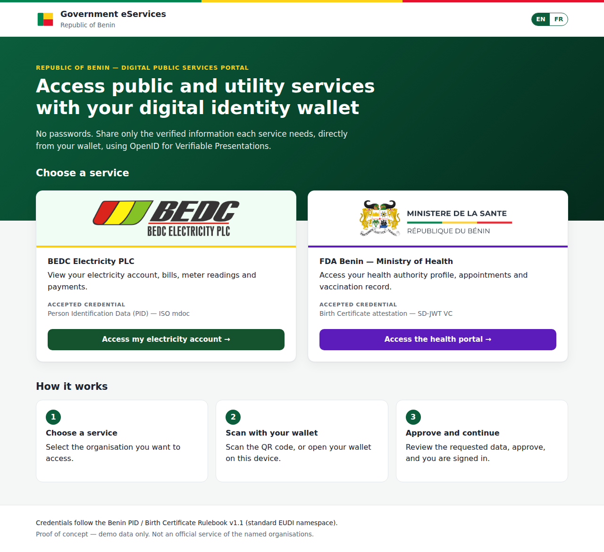
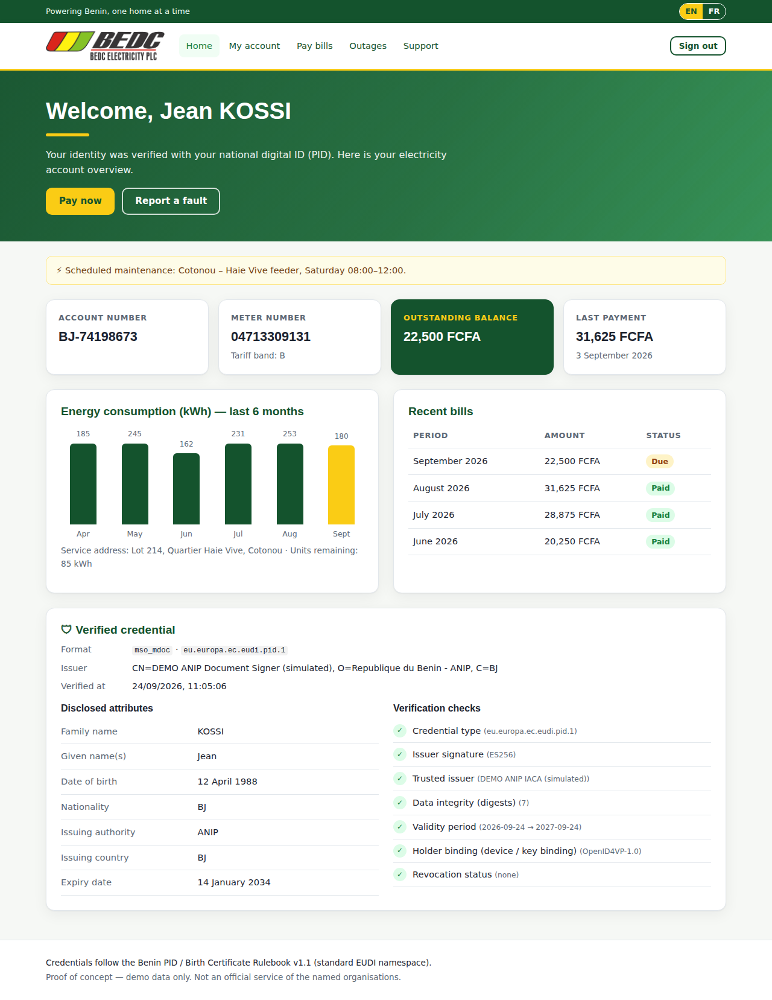
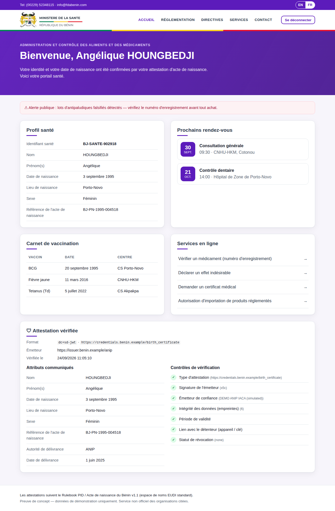

# Benin Government eServices — Relying Party PoC

A bilingual (English / French) **Government eServices portal** with two
relying-party websites that sign users in by verifying credentials from an
EUDI-compatible wallet over **OpenID4VP**:

| Service | Branding | Accepted credential | Format |
|---|---|---|---|
| **BEDC Electricity PLC** — electricity account | BEDC logo, deep green `#14532d` + yellow `#facc15` | Benin **PID** | ISO/IEC 18013-5 **mdoc** (`eu.europa.ec.eudi.pid.1`) |
| **FDA Benin / Ministère de la Santé** — health portal | Ministry logo, purple `#5c1bbb`, Benin flag stripe | **Birth Certificate attestation** | **SD-JWT VC** (`dc+sd-jwt`) |

After a successful presentation each site opens a dummy dashboard ("Welcome,
<name>") that also shows the disclosed attributes and every verification check.

Credential types, namespaces and claim names follow the **Benin PID / Birth
Certificate Rulebook v1.1 (Standard-Namespace Edition)** — see
[`src/rulebook.js`](src/rulebook.js).

> ⚠️ Proof of concept. The dashboards contain dummy data, and the site is not
> an official service of BEDC or the FDA / Ministry of Health. Their logos are
> used here only to demo the branding.

| Portal | BEDC (PID mdoc) | FDA (Birth Certificate SD-JWT, FR) |
|---|---|---|
|  |  |  |

## Quick start

```bash
cd "Benin poc"
npm install
cp .env.example .env
npm start            # http://localhost:3000
npm test             # 15 tests: verifiers, tampering, web flow, i18n
```

Open http://localhost:3000, pick a service, then either scan the QR code with a
wallet or click **Demo: simulate wallet**. The simulated wallet presents
rulebook-conformant demo credentials, signed by a temporary *simulated ANIP*
issuer that is created at start-up (`DEMO_MODE=true`).

Change the language with the **EN / FR** switch on any page. The choice is
kept in a cookie, and the browser's `Accept-Language` sets the default.

## Using a real wallet

The wallet sends its response to `<BASE_URL>/oid4vp/response`, so the server must
be reachable from the phone:

```bash
ngrok http 3000                       # or deploy to Render / Railway / Fly
BASE_URL=https://<your-url> npm start
```

To match what your wallet supports, set these in `.env`:

- `QUERY_LANGUAGE=dcql` (default, OpenID4VP 1.0 `dcql_query`) or `pex`
  (presentation_definition, older drafts).
- `REQUEST_MODE=reference` (default) gives a short QR code that uses `request_uri`.
  `value` puts the whole request in a very dense QR code.
- `CLIENT_ID` / `CLIENT_ID_SCHEME` to match your registered verifier identifier.
- Put the ANIP IACA and issuer certificates in [`trust/`](trust/README.md). Set
  `REQUIRE_TRUSTED_ISSUER=true` and `REQUIRE_HOLDER_BINDING=true` to make those
  checks mandatory.
- Set `DEMO_MODE=false` to hide the simulator.

## Troubleshooting a real wallet

**SIGMA (IN Groupe) and other wallets built on `eudi-lib-jvm-openid4vp-kt`**
accept only DCQL, only *signed* request objects for `request_uri`, and unsigned
requests only with a `redirect_uri:` client_id (or a client_id pre-registered in
the wallet). Without a verifier certificate the wallet trusts, use test variant 5,
or set:

```
REQUEST_MODE=value
QUERY_LANGUAGE=dcql
CLIENT_ID=redirect_uri:https://<your-app>.onrender.com/oid4vp/response
CLIENT_METADATA=false
RESPONSE_MODE=direct_post.jwt
```

**Birth certificate with SIGMA:** the wallet only offers a credential whose
`vct` is listed in `BIRTH_CERT_VCTS` (the rulebook fixes the mdoc docType but not
the SD-JWT `vct`). Check the `vct` of the birth certificate in the wallet or
the issuer's metadata and set `BIRTH_CERT_VCTS` to it. The request uses DCQL
`claim_sets`, so a certificate with only the required claims (names, birth date,
`birth_record_reference`) still matches. The FDA request accepts the birth
certificate either as SD-JWT VC or as mdoc (`eu.europa.ec.eudi.birth_certificate.1`,
rulebook: "mdoc optional"), via DCQL `credential_sets`; in the compact by-value
form it asks only for the required claims so the QR code stays scannable.

SIGMA applies the HAIP profile, so responses must be encrypted
(`direct_post.jwt`). Each transaction gets its own P-256 key, published in
`client_metadata.jwks`; the wallet encrypts `{vp_token, state}` to it (JWE,
`ECDH-ES` + `A128GCM`), and the mdoc SessionTranscript is bound to that key's
JWK thumbprint.

**Wallet test page:** open `/bedc/wallet-test` or `/fda/wallet-test` (linked from
each login page). It shows the same request five ways: current settings, all
in the QR code (like the original test RP), OpenID4VP 1.0 DCQL,
`client_id_scheme=redirect_uri`, and the 1.0 `redirect_uri:` prefix. Scan each
one; the card turns amber when the wallet fetches or answers, and green when
the login verifies. A green card lists the environment variables that make
that variant the default. Dense QR codes (variants 2, 4 and 5) scan more
easily on a large screen or with the browser zoomed in.

Each wallet call is logged with a `[wallet]` prefix (in Render: **Logs**):

| What you see | Meaning | What to try |
|---|---|---|
| No `[wallet]` line after scanning | The wallet did not understand the QR code or link | Check the wallet's deep-link scheme (`WALLET_SCHEME`, e.g. `eudi-openid4vp://` or `haip://`); open *Trouble scanning? Show the wallet link* and paste the link into the wallet |
| `GET /oid4vp/request/… -> 200`, then nothing | Wallet fetched the request but refused it | Usually the client identifier: set `CLIENT_ID` / `CLIENT_ID_SCHEME` to what the wallet accepts; try `QUERY_LANGUAGE=dcql` for OpenID4VP 1.0 wallets |
| `POST /oid4vp/response -> 200` with `reasons` | Wallet responded; the verifier rejected it | The log line lists the failed checks |

The login page also changes to *Wallet connected* as soon as the wallet fetches
the request, so you can tell from the screen that the QR code was read.

## What is requested (Rulebook “Verifier Matrix”)

**BEDC — Identity verification (PID mdoc, namespace `eu.europa.ec.eudi.pid.1`)**
`family_name, given_name, birth_date, nationality, issuing_authority, issuing_country, expiry_date`

**FDA — Birth-date corroboration (Birth Certificate SD-JWT)**
`family_name, given_name, birth_date, birth_place, gender, birth_record_reference, issuing_authority, issuance_date`

Data minimisation: `portrait`, `resident_address` and
`personal_administrative_number` (NPI) are never requested, and the parents'
names (filiation) are not requested by the health portal. Every mdoc element is
requested with `intent_to_retain: false`.

## What is verified

| Check | PID mdoc | Birth Certificate SD-JWT |
|---|---|---|
| Credential type | `docType` = `eu.europa.ec.eudi.pid.1` (document and MSO) | `vct` is in `BIRTH_CERT_VCTS` |
| Issuer signature | COSE_Sign1 `issuerAuth` checked against the `x5chain` leaf | JWS checked against `x5c`, or against `<iss>/.well-known/jwt-vc-issuer` |
| Trusted issuer | chain validated up to a certificate in `trust/` | same (`x5c`) or `TRUSTED_ISSUERS` |
| Data integrity | each IssuerSignedItem digest matches the MSO `valueDigests` | each disclosure digest is in `_sd` / `...`; injected or duplicated disclosures are rejected |
| Validity | MSO `validFrom` / `validUntil` | `exp` / `nbf` |
| Holder binding | `DeviceAuth` signature over the OpenID4VP SessionTranscript, using the MSO device key | KB-JWT: `cnf.jwk` signature, `nonce`, `aud`, `sd_hash`, `iat` |
| Replay | one-time `state` + `nonce` for each transaction | same |
| Status | not checked in the PoC; the interface is kept open for it, as the rulebook allows | same |

## Security of the login flow

- Each transaction is bound to the browser that started it with a signed
  cookie, so another browser cannot see its status or complete the login.
- In the same-device flow, the wallet gets a `redirect_uri` that carries a
  one-time `response_code`.
- Sessions are in-memory, HttpOnly, SameSite=Lax cookies, and `Secure` when
  `BASE_URL` is https.

## Project layout

```
server.js                 Express app: portal, RP routes, OpenID4VP endpoints
src/rulebook.js           Rulebook constants and per-RP claim requests
src/oid4vp.js             Authorization request (PEX / DCQL, by value / reference), response handling, policy
src/verify/mdoc.js        ISO 18013-5 DeviceResponse verification
src/verify/sdjwt.js       SD-JWT VC + KB-JWT verification
src/verify/trust.js       Trust anchors and X.509 chain validation
src/demo/wallet.js        Simulated ANIP issuer and wallet (DEMO_MODE)
src/i18n.js, locales/     English / French strings
views/                    EJS templates (portal, login, dashboards)
public/                   CSS per brand, login script, logos
test/                     node:test suites
```

## Not in scope for the PoC

- Signed request objects (`x509_san_dns` / `x509_hash` / `verifier_attestation`)
- Checking Token Status Lists
- Persistent storage for sessions and transactions (they are in memory; use
  Redis or a database for more than one instance)
