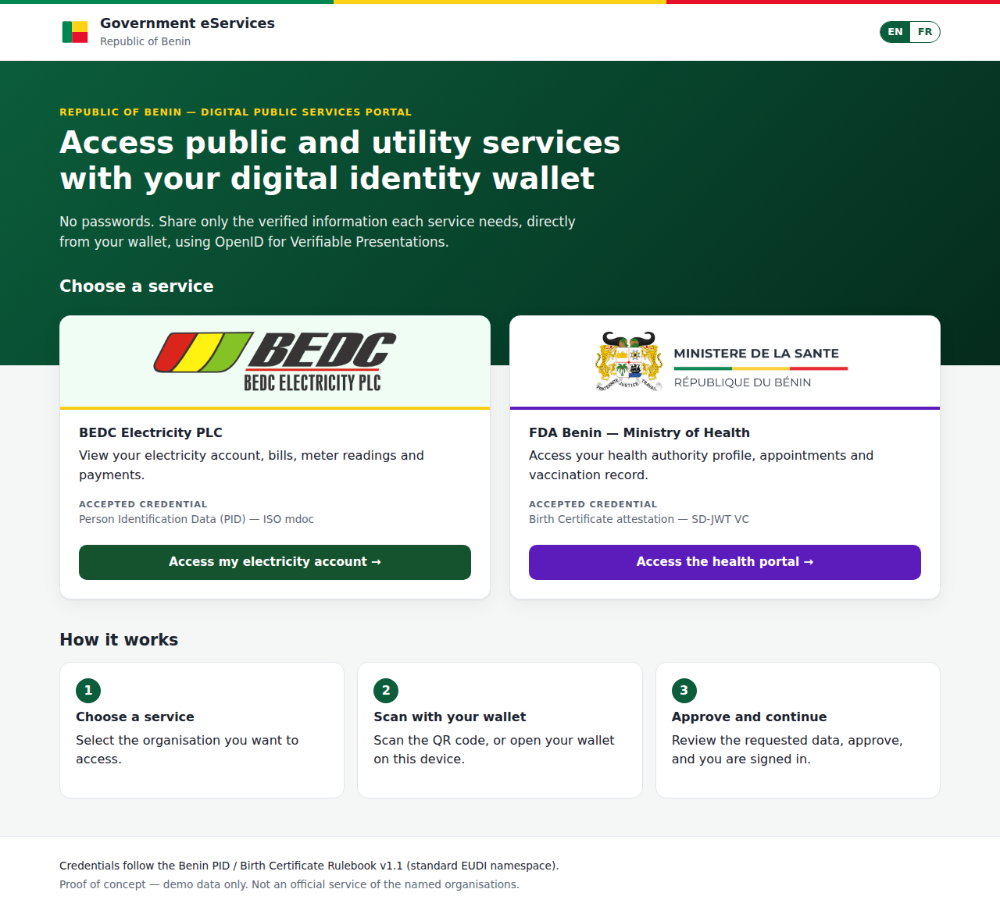
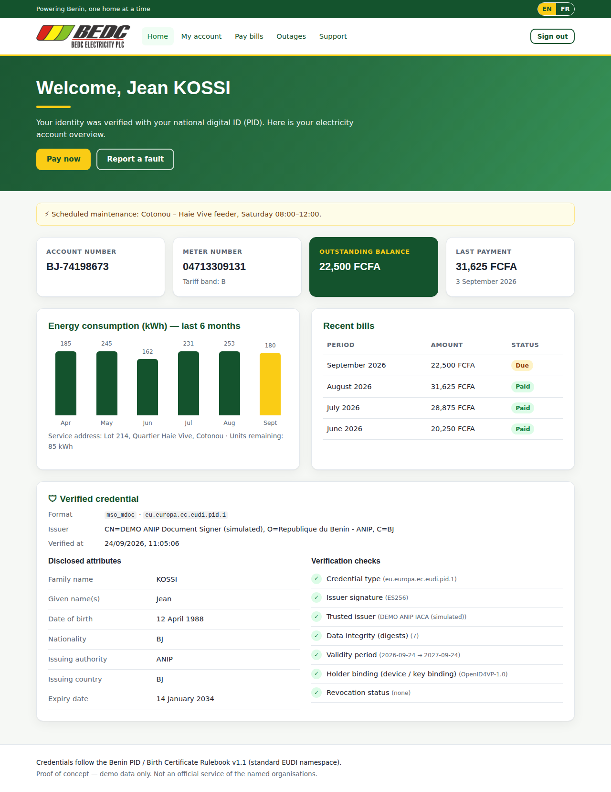
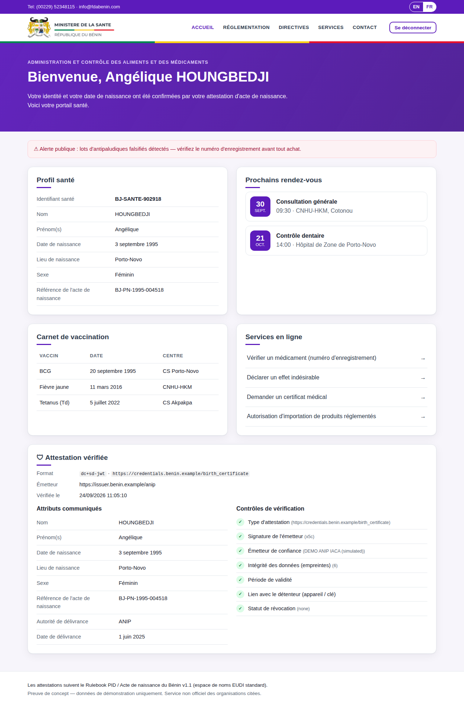
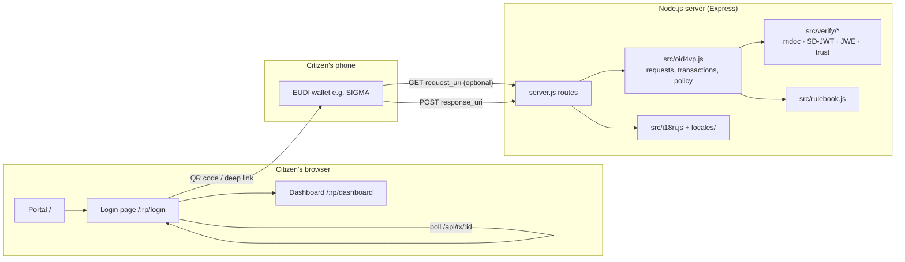
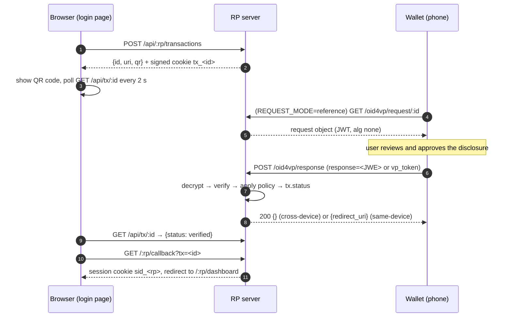
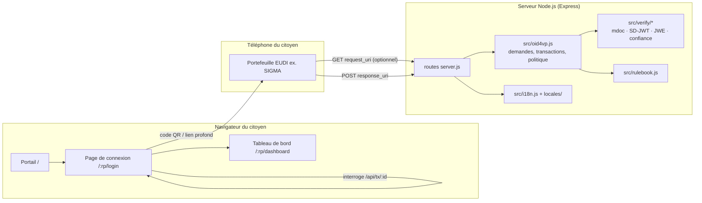
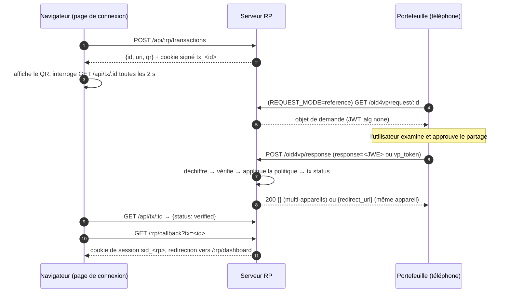

# Benin Government eServices — Relying Party PoC

A bilingual (English / French) **Government eServices portal** with two
relying-party websites that sign users in by verifying credentials from an
EUDI-compatible wallet over **OpenID4VP**:

| Service | Branding | Accepted credential | Format |
|---|---|---|---|
| **BEDC Electricity PLC** — electricity account | BEDC logo, deep green `#14532d` + yellow `#facc15` | Benin **PID** | ISO/IEC 18013-5 **mdoc** (`eu.europa.ec.eudi.pid.1`) |
| **FDA Benin / Ministère de la Santé** — health portal | Ministry logo, purple `#5c1bbb`, Benin flag stripe | **Birth Certificate attestation** | **SD-JWT VC** (`dc+sd-jwt`) |

After a successful presentation each site opens a dummy dashboard ("Welcome,
<name>") that also shows the disclosed attributes and every verification check.

Credential types, namespaces and claim names follow the **Benin PID / Birth
Certificate Rulebook v1.1 (Standard-Namespace Edition)** — see
[`src/rulebook.js`](src/rulebook.js).

> ⚠️ Proof of concept. The dashboards contain dummy data, and the site is not
> an official service of BEDC or the FDA / Ministry of Health. Their logos are
> used here only to demo the branding.

| Portal | BEDC (PID mdoc) | FDA (Birth Certificate SD-JWT, FR) |
|---|---|---|
|  |  |  |

**Developer documentation:** [Developer Guide (English)](#developer-guide-english) · [Guide du développeur (Français)](#guide-du-développeur-français)

## Quick start

```bash
cd "Benin poc"
npm install
cp .env.example .env
npm start            # http://localhost:3000
npm test             # 25 tests: verifiers, tampering, encryption, web flow, i18n
```

Open http://localhost:3000, pick a service, then either scan the QR code with a
wallet or click **Demo: simulate wallet**. The simulated wallet presents
rulebook-conformant demo credentials, signed by a temporary *simulated ANIP*
issuer that is created at start-up (`DEMO_MODE=true`).

Change the language with the **EN / FR** switch on any page. The choice is
kept in a cookie, and the browser's `Accept-Language` sets the default.

## Using a real wallet

The wallet sends its response to `<BASE_URL>/oid4vp/response`, so the server must
be reachable from the phone:

```bash
ngrok http 3000                       # or deploy to Render / Railway / Fly
BASE_URL=https://<your-url> npm start
```

To match what your wallet supports, set these in `.env`:

- `QUERY_LANGUAGE=dcql` (default, OpenID4VP 1.0 `dcql_query`) or `pex`
  (presentation_definition, older drafts).
- `REQUEST_MODE=reference` (default) gives a short QR code that uses `request_uri`.
  `value` puts the whole request in a very dense QR code.
- `CLIENT_ID` / `CLIENT_ID_SCHEME` to match your registered verifier identifier.
- Put the ANIP IACA and issuer certificates in [`trust/`](trust/README.md). Set
  `REQUIRE_TRUSTED_ISSUER=true` and `REQUIRE_HOLDER_BINDING=true` to make those
  checks mandatory.
- Set `DEMO_MODE=false` to hide the simulator.

## Troubleshooting a real wallet

**SIGMA (IN Groupe) and other wallets built on `eudi-lib-jvm-openid4vp-kt`**
accept only DCQL, only *signed* request objects for `request_uri`, and unsigned
requests only with a `redirect_uri:` client_id (or a client_id pre-registered in
the wallet). Without a verifier certificate the wallet trusts, use test variant 5,
or set:

```
REQUEST_MODE=value
QUERY_LANGUAGE=dcql
CLIENT_ID=redirect_uri:https://<your-app>.onrender.com/oid4vp/response
CLIENT_METADATA=false
RESPONSE_MODE=direct_post.jwt
```

**Birth certificate with SIGMA:** the wallet only offers a credential whose
`vct` is listed in `BIRTH_CERT_VCTS` (the rulebook fixes the mdoc docType but not
the SD-JWT `vct`). Check the `vct` of the birth certificate in the wallet or
the issuer's metadata and set `BIRTH_CERT_VCTS` to it. The request uses DCQL
`claim_sets`, so a certificate with only the required claims (names, birth date,
`birth_record_reference`) still matches. The FDA request accepts the birth
certificate either as SD-JWT VC or as mdoc (`eu.europa.ec.eudi.birth_certificate.1`,
rulebook: "mdoc optional"), via DCQL `credential_sets`. The compact by-value QR
request has room for one format only: `BIRTH_CERT_COMPACT_FORMAT` (default
`dc+sd-jwt`, which is how SIGMA holds it). Only names and birth date are mandatory
for matching; `birth_record_reference` is shared when the credential has it.

SIGMA applies the HAIP profile, so responses must be encrypted
(`direct_post.jwt`). Each transaction gets its own P-256 key, published in
`client_metadata.jwks`; the wallet encrypts `{vp_token, state}` to it (JWE,
`ECDH-ES` + `A128GCM`), and the mdoc SessionTranscript is bound to that key's
JWK thumbprint.

**Wallet test page:** open `/bedc/wallet-test` or `/fda/wallet-test` (linked from
each login page). It shows the same request five ways: current settings, all
in the QR code (like the original test RP), OpenID4VP 1.0 DCQL,
`client_id_scheme=redirect_uri`, and the 1.0 `redirect_uri:` prefix. Scan each
one; the card turns amber when the wallet fetches or answers, and green when
the login verifies. A green card lists the environment variables that make
that variant the default. Dense QR codes (variants 2, 4 and 5) scan more
easily on a large screen or with the browser zoomed in.

Each wallet call is logged with a `[wallet]` prefix (in Render: **Logs**):

| What you see | Meaning | What to try |
|---|---|---|
| No `[wallet]` line after scanning | The wallet did not understand the QR code or link | Check the wallet's deep-link scheme (`WALLET_SCHEME`, e.g. `eudi-openid4vp://` or `haip://`); open *Trouble scanning? Show the wallet link* and paste the link into the wallet |
| `GET /oid4vp/request/… -> 200`, then nothing | Wallet fetched the request but refused it | Usually the client identifier: set `CLIENT_ID` / `CLIENT_ID_SCHEME` to what the wallet accepts; try `QUERY_LANGUAGE=dcql` for OpenID4VP 1.0 wallets |
| `POST /oid4vp/response -> 200` with `reasons` | Wallet responded; the verifier rejected it | The log line lists the failed checks |

The login page also changes to *Wallet connected* as soon as the wallet fetches
the request, so you can tell from the screen that the QR code was read.

## What is requested (Rulebook “Verifier Matrix”)

**BEDC — Identity verification (PID mdoc, namespace `eu.europa.ec.eudi.pid.1`)**
`family_name, given_name, birth_date, nationality, issuing_authority, issuing_country, expiry_date`

**FDA — Birth-date corroboration (Birth Certificate SD-JWT)**
`family_name, given_name, birth_date, birth_place, gender, birth_record_reference, issuing_authority, issuance_date`

Data minimisation: `portrait`, `resident_address` and
`personal_administrative_number` (NPI) are never requested, and the parents'
names (filiation) are not requested by the health portal. Every mdoc element is
requested with `intent_to_retain: false`.

## What is verified

| Check | PID mdoc | Birth Certificate SD-JWT |
|---|---|---|
| Credential type | `docType` = `eu.europa.ec.eudi.pid.1` (document and MSO) | `vct` is in `BIRTH_CERT_VCTS` |
| Issuer signature | COSE_Sign1 `issuerAuth` checked against the `x5chain` leaf | JWS checked against `x5c`, or against `<iss>/.well-known/jwt-vc-issuer` |
| Trusted issuer | chain validated up to a certificate in `trust/` | same (`x5c`) or `TRUSTED_ISSUERS` |
| Data integrity | each IssuerSignedItem digest matches the MSO `valueDigests` | each disclosure digest is in `_sd` / `...`; injected or duplicated disclosures are rejected |
| Validity | MSO `validFrom` / `validUntil` | `exp` / `nbf` |
| Holder binding | `DeviceAuth` signature over the OpenID4VP SessionTranscript, using the MSO device key | KB-JWT: `cnf.jwk` signature, `nonce`, `aud`, `sd_hash`, `iat` |
| Replay | one-time `state` + `nonce` for each transaction | same |
| Status | not checked in the PoC; the interface is kept open for it, as the rulebook allows | same |

## Security of the login flow

- Each transaction is bound to the browser that started it with a signed
  cookie, so another browser cannot see its status or complete the login.
- In the same-device flow, the wallet gets a `redirect_uri` that carries a
  one-time `response_code`.
- Sessions are in-memory, HttpOnly, SameSite=Lax cookies, and `Secure` when
  `BASE_URL` is https.

## Project layout

```
server.js                 Express app: portal, RP routes, OpenID4VP endpoints
src/rulebook.js           Rulebook constants and per-RP claim requests
src/oid4vp.js             Authorization request (PEX / DCQL, by value / reference), response handling, policy
src/verify/mdoc.js        ISO 18013-5 DeviceResponse verification
src/verify/sdjwt.js       SD-JWT VC + KB-JWT verification
src/verify/trust.js       Trust anchors and X.509 chain validation
src/demo/wallet.js        Simulated ANIP issuer and wallet (DEMO_MODE)
src/i18n.js, locales/     English / French strings
views/                    EJS templates (portal, login, dashboards)
public/                   CSS per brand, login script, logos
test/                     node:test suites
```

## Not in scope for the PoC

- Signed request objects (`x509_san_dns` / `x509_hash` / `verifier_attestation`)
- Checking Token Status Lists
- Persistent storage for sessions and transactions (they are in memory; use
  Redis or a database for more than one instance)

---

## Developer Guide (English)

*[Version française : Guide du développeur](#guide-du-développeur-français)*

This guide is for developers who run, change or integrate the PoC. The
sections above are the short version; this guide explains how the code works
and why it is built the way it is.

---

### 1. What the PoC does

The PoC is a bilingual (English / French) **Government eServices portal**. Two
relying-party (RP) websites sign citizens in by verifying a credential from
an EUDI-compatible wallet over **OpenID for Verifiable Presentations
(OpenID4VP)**:

| Relying party | Route | Credential accepted | Format |
|---|---|---|---|
| BEDC Electricity PLC | `/bedc` | Benin PID | ISO/IEC 18013-5 **mdoc**, docType `eu.europa.ec.eudi.pid.1` |
| FDA Benin / Ministry of Health | `/fda` | Birth Certificate attestation | **SD-JWT VC** (`dc+sd-jwt`); mdoc `eu.europa.ec.eudi.birth_certificate.1` also accepted |

After a successful presentation, the RP opens a dummy dashboard. The dashboard
shows the disclosed attributes and the result of every verification check.

The credential profiles follow the **Benin PID / Birth Certificate Rulebook
v1.1 (Standard-Namespace Edition)**.

> **Scope:** this is a proof of concept. Dashboards contain dummy data,
> sessions are kept in memory, and the site is not an official BEDC or FDA
> service. See [§12](#12-security-notes-and-limitations) before you use real
> personal data.

---

### 2. Architecture


```mermaid
flowchart LR
  subgraph Browser["Citizen's browser"]
    P[Portal /] --> L[Login page /:rp/login]
    L -->|poll /api/tx/:id| L
    L --> D[Dashboard /:rp/dashboard]
  end
  subgraph Phone["Citizen's phone"]
    W[EUDI wallet e.g. SIGMA]
  end
  subgraph Server["Node.js server (Express)"]
    API[server.js routes]
    O[src/oid4vp.js<br/>requests, transactions, policy]
    V[src/verify/*<br/>mdoc · SD-JWT · JWE · trust]
    R[src/rulebook.js]
    I[src/i18n.js + locales/]
  end
  L -- QR code / deep link --> W
  W -- GET request_uri (optional) --> API
  W -- POST response_uri --> API
  API --> O --> V
  O --> R
  API --> I
```

* **One process, no database.** Transactions (pending logins) and sessions
  live in memory, in `Map` objects.
* **Server-rendered pages.** The pages are EJS templates. Only small scripts
  run in the browser: `public/js/login.js` and `public/js/wallet-test.js`.
* **No external crypto services.** Signature checks, X.509 chains, CBOR/COSE
  and JWE decryption use Node's `crypto`, plus `cbor-x` for CBOR.

#### Runtime dependencies

| Package | Used for |
|---|---|
| `express` 5, `cookie-parser`, `ejs` | web server, signed cookies, templates |
| `qrcode` | QR code rendering (data URL) |
| `cbor-x` | mdoc CBOR decoding and encoding |
| `dotenv` | `.env` loading |
| `@peculiar/x509`, `reflect-metadata` | **demo wallet only**: creates the simulated ANIP IACA and document-signer certificates at start-up |

---

### 3. Project layout

```
Benin poc/
├── server.js                 Express app: portal, RP routes, OpenID4VP endpoints
├── src/
│   ├── config.js             All environment settings (see §5)
│   ├── rulebook.js           Rulebook constants and per-RP credential requests
│   ├── oid4vp.js             Request building (DCQL/PEX, by value/reference, variants),
│   │                         transactions, response handling, acceptance policy
│   ├── verify/
│   │   ├── mdoc.js           ISO 18013-5 DeviceResponse verification (COSE, MSO, DeviceAuth)
│   │   ├── sdjwt.js          SD-JWT VC + Key Binding JWT verification
│   │   ├── jwe.js            JWE ECDH-ES + A128GCM/A256GCM (encrypted responses)
│   │   ├── jose.js           JWS / signature helpers
│   │   └── trust.js          Trust anchors and X.509 chain validation
│   ├── demo/wallet.js        Simulated ANIP issuer and wallet (DEMO_MODE, tests)
│   ├── dashboard-data.js     Deterministic dummy dashboard data
│   └── i18n.js               Language selection middleware
├── locales/en.json, fr.json  All UI strings (both files must have the same keys)
├── views/                    EJS templates (portal, login, wallet-test, dashboards, partials)
├── public/                   CSS per brand, browser scripts, logos
├── trust/                    Trusted issuer / IACA certificates (PEM, git-ignored)
├── test/                     node:test suites
└── docs/                     This guide and screenshots
```

---

### 4. Getting started

#### 4.1 Run locally

Requires **Node.js 20 or later**.

```bash
cd "Benin poc"
npm install
cp .env.example .env
npm start          # http://localhost:3000
npm run dev        # same, restarts on file changes
npm test           # 25 tests
```

Open the portal, choose a service, and click **Demo: simulate wallet**. This
runs the full flow (request, encrypted response, verification, session,
dashboard) with demo credentials signed by a simulated ANIP issuer that is
created at start-up.

#### 4.2 Testing with a real wallet

The wallet must reach `<BASE_URL>/oid4vp/response` over HTTPS, so `localhost`
does not work with a phone. Use a tunnel (`ngrok http 3000`) or deploy (§4.3),
then set `BASE_URL` to that public URL.

#### 4.3 Deploying on Render.com

| Setting | Value |
|---|---|
| Root Directory | `Benin poc` (the repository root holds an older, unrelated test RP) |
| Build / Start command | `npm install` / `npm start` |
| Environment | `BASE_URL=https://<service>.onrender.com`, `SESSION_SECRET=<random>`, plus the wallet profile from §10 |

Notes:

* Render sets `PORT` itself, and `trust proxy` is enabled.
* On the free plan the service sleeps after about 15 minutes without traffic,
  so open the site shortly before a demo.
* State is kept in memory, so a restart signs everyone out and drops any
  pending QR codes.

Check the deployment at `GET /health`. It returns the effective `baseUrl`,
`responseUri` and `queryLanguage`.

---

### 5. Configuration reference

All settings are environment variables, read in `src/config.js`.
`.env.example` documents each one.

| Variable | Default | Meaning |
|---|---|---|
| `BASE_URL` | `http://localhost:3000` | Public URL of the server. The host is lower-cased, because wallets compare `client_id` and `response_uri` as plain strings. |
| `PORT` | `3000` | Listening port |
| `CLIENT_ID` | `benin-eservices-rp.poc` | OpenID4VP `client_id`. For SIGMA, use `redirect_uri:<BASE_URL>/oid4vp/response`. |
| `BEDC_CLIENT_ID`, `FDA_CLIENT_ID` | `CLIENT_ID` | Per-RP override |
| `CLIENT_ID_SCHEME` | *(empty)* | Sends `client_id_scheme`, needed by some pre-1.0 wallets |
| `QUERY_LANGUAGE` | `dcql` | `dcql` (OpenID4VP 1.0 `dcql_query`) or `pex` (`presentation_definition`) |
| `REQUEST_MODE` | `reference` | `reference`: short QR code with an unsigned `request_uri`. `value`: all parameters in the QR code. |
| `RESPONSE_MODE` | `direct_post.jwt` | `direct_post.jwt`: the wallet encrypts its response, as HAIP requires. `direct_post`: plain form POST. |
| `CLIENT_METADATA` | `true` | Sends full `client_metadata`. With `false`, only the encryption key and `vp_formats_supported` are sent (compact QR). |
| `WALLET_SCHEME` | `openid4vp://` | Deep-link scheme in the QR code and button |
| `REQUIRE_TRUSTED_ISSUER` | `false` | Rejects issuers that don't chain to `trust/` |
| `REQUIRE_HOLDER_BINDING` | `false` | Rejects presentations without valid DeviceAuth / KB-JWT |
| `TRUST_DIR` | `./trust` | Folder of PEM trust anchors |
| `TRUSTED_ISSUERS` | *(empty)* | SD-JWT `iss` values whose keys may be fetched from `/.well-known/jwt-vc-issuer` |
| `BIRTH_CERT_VCTS` | 3 candidate URIs | Accepted SD-JWT `vct` values for the birth certificate |
| `BIRTH_CERT_COMPACT_FORMAT` | `dc+sd-jwt` | Birth certificate format in the compact QR request, which has room for one format only |
| `DEMO_MODE` | `true` | Shows the *simulate wallet* button and trusts the simulated issuer. **Disable in production.** |
| `SESSION_SECRET` | random per start | Cookie signing key. Set it so that sessions survive restarts. |

---

### 6. OpenID4VP flow

#### 6.1 Sequence (cross-device, QR code)


```mermaid
sequenceDiagram
  autonumber
  participant B as Browser (login page)
  participant S as RP server
  participant W as Wallet (phone)
  B->>S: POST /api/:rp/transactions
  S-->>B: {id, uri, qr} + signed cookie tx_<id>
  B->>B: show QR code, poll GET /api/tx/:id every 2 s
  W->>S: (REQUEST_MODE=reference) GET /oid4vp/request/:id
  S-->>W: request object (JWT, alg none)
  Note over W: user reviews and approves the disclosure
  W->>S: POST /oid4vp/response  (response=<JWE> or vp_token)
  S->>S: decrypt → verify → apply policy → tx.status
  S-->>W: 200 {} (cross-device) or {redirect_uri} (same-device)
  B->>S: GET /api/tx/:id → {status: verified}
  B->>S: GET /:rp/callback?tx=<id>
  S-->>B: session cookie sid_<rp>, redirect to /:rp/dashboard
```

**Same-device flow:** the user taps *Open wallet on this device*, and the login
page calls `POST /api/tx/:id/same-device`. Only in that case does the server
return a `redirect_uri` with a one-time `response_code`, so that the wallet
sends the phone's browser back to the RP. In the QR flow no `redirect_uri` is
sent, because SIGMA reacted to it by showing its consent screen a second time.

#### 6.2 Transaction lifecycle

A transaction (`createTransaction` in `src/oid4vp.js`) holds:

* `state` and `nonce`, both random;
* a `browserKey` cookie value, which binds the login to the browser that
  started it;
* the `responseCode` for the same-device flow;
* for encrypted responses, a fresh **P-256 encryption key pair**.

```
pending ──(wallet response verified)──▶ verified ──(callback)──▶ consumed
   │
   └──(error / failed policy / wallet error)──▶ rejected
walletStep: null → request_fetched → response_received   (shown on the login page)
```

Transactions expire after 10 minutes (`TX_TTL_MS`) and login sessions after
30 minutes (`LOGIN_TTL_MS`).

A state can only be used once. If the same wallet re-sends a response
encrypted to a finished transaction's key, the server acknowledges it with
`200 {}` and doesn't process it again. Any other replay gets `400`.

#### 6.3 Building the request

`requestParameters(tx)` assembles the following:

| Parameter | Source |
|---|---|
| `response_type` | `vp_token` |
| `client_id` / `client_id_scheme` | from config or the variant |
| `response_mode` | `direct_post.jwt` (default) or `direct_post` |
| `response_uri` | `<BASE_URL>/oid4vp/response` |
| `nonce`, `state` | from the transaction |
| `dcql_query` or `presentation_definition` | from the RP profile (§7) |
| `client_metadata` | `vp_formats_supported` is built **from the formats actually used in the query**. With encryption it also carries `jwks` (the transaction key, with `kid` and `alg: ECDH-ES`) and `encrypted_response_enc_values_supported`. |

**Delivery:**

* `REQUEST_MODE=reference`: the QR code holds only `client_id` and
  `request_uri`. The wallet fetches an unsigned request object
  (`application/oauth-authz-req+jwt`, `alg: none`).
* `REQUEST_MODE=value`: all parameters go in the URL. They are encoded with
  `encodeQuery`, which leaves `:` `/` `,` `@` readable to keep the QR code
  smaller.

**Compact mode.** When the request is sent by value without full metadata, the
following reductions keep the QR code at about version 27 (~1,400 characters),
which a phone camera can read:

* `intent_to_retain` is omitted.
* Only HAIP's ES256 algorithms are listed.
* For the FDA, only one birth certificate format is requested
  (`BIRTH_CERT_COMPACT_FORMAT`), with the claims in `compactClaims`.

On screen, dense QR codes are shown at 440 px; tapping one shows it full screen.

**Variants** (`VARIANTS` in `src/oid4vp.js`, used by the wallet test page):

| Variant | client_id | Query | Delivery | Response |
|---|---|---|---|---|
| `configured` | from config | from config | from config | from config |
| `legacy` | bare `CLIENT_ID` | PEX | value | `direct_post` |
| `dcql` | from config | DCQL | reference | from config |
| `redirect_uri` | `response_uri` + `client_id_scheme=redirect_uri` | PEX | value | from config |
| `redirect_uri_prefix` | `redirect_uri:<response_uri>` | DCQL | value | `direct_post.jwt` |

#### 6.4 Handling the response

`handleWalletResponse(body)` processes the wallet's POST as follows:

1. **Encrypted** (`response=<JWE>`): reads the JWE header `kid`, finds the
   transaction that owns that key, decrypts the JWE (`src/verify/jwe.js`), and
   checks that the decrypted `state` matches.
2. Rejects an unencrypted response if encryption was requested.
3. Records a wallet `error` parameter as `wallet_error:<code>`.
4. Flattens `vp_token`, whether it is a string, an array, or a DCQL object
   `{credentialId: [presentations]}`.
5. Verifies each presentation: a string containing `~` is an SD-JWT, anything
   else is a base64url DeviceResponse.
6. Applies the acceptance policy (`evaluate`), described in §8.4.

---

### 7. Credential profiles (from the rulebook)

All rulebook constants live in `src/rulebook.js`.

| | BEDC (`bedc`) | FDA (`fda`) |
|---|---|---|
| Verifier Matrix use case | Identity verification | Birth-date corroboration |
| Primary credential | PID mdoc `eu.europa.ec.eudi.pid.1`, namespace `eu.europa.ec.eudi.pid.1` | Birth Certificate SD-JWT VC; `vct` in `BIRTH_CERT_VCTS` |
| Alternative | — | mdoc `eu.europa.ec.eudi.birth_certificate.1` (rulebook: "mdoc optional"), offered through DCQL `credential_sets` |
| Claims requested | `family_name, given_name, birth_date, nationality, issuing_authority, issuing_country, expiry_date` | `family_name, given_name, birth_date, birth_place, gender, birth_record_reference, issuing_authority, issuance_date` |
| Required for login | `family_name, given_name, birth_date` | `family_name, given_name, birth_date` |
| Compact QR request | same claims | `family_name, given_name, birth_date, birth_record_reference`, with `claim_sets` making `birth_record_reference` optional |

**Data minimisation:** `portrait`, `resident_address`,
`personal_administrative_number` (NPI) and the parents' names are never
requested.

> **Open point:** the rulebook fixes the birth certificate's mdoc docType, but
> not its SD-JWT `vct`. The `vct` that SIGMA's issuer uses must be confirmed
> with IN Groupe, then set in `BIRTH_CERT_VCTS` (see §10).

---

### 8. Verification pipeline

Every presentation produces a result object:

```js
{
  format,
  claims,
  vct | docType,
  issuer,
  checks: {
    credentialType, issuerSignature, trustedIssuer,
    disclosures, validity, holderBinding, status
  },
  errors
}
```

Each check is `{ ok, detail }`. The dashboard's *Verified credential* panel
shows all of them.

#### 8.1 mdoc (`src/verify/mdoc.js`)

| Check | How |
|---|---|
| Issuer signature | COSE_Sign1 `issuerAuth` (`Sig_structure`, ES256/384/512, EdDSA) verified against the leaf of `x5chain` (label 33) |
| Trusted issuer | `x5chain` validated up to a certificate in `trust/` (`trust.js`) |
| Credential type | document `docType` = MSO `docType` = expected docType |
| Validity | MSO `validityInfo.validFrom` ≤ now ≤ `validUntil` |
| Data integrity | each `IssuerSignedItem` (tag 24) is hashed and compared with MSO `valueDigests[namespace][digestID]` |
| Holder binding | `DeviceAuth` COSE_Sign1 over `DeviceAuthenticationBytes`, checked with the MSO device key, for each candidate `SessionTranscript` (below) |

The candidate `SessionTranscript` values are:

* OpenID4VP 1.0 `OpenID4VPHandover`, with the verifier key's **JWK
  thumbprint** when the response was encrypted;
* the same handover with a `null` thumbprint;
* the ISO 18013-7 `OID4VPHandover`, built with the `mdocGeneratedNonce` from
  the JWE `apu`.

#### 8.2 SD-JWT VC (`src/verify/sdjwt.js`)

| Check | How |
|---|---|
| Issuer signature | JWS checked with the `x5c` leaf, or a key from `<iss>/.well-known/jwt-vc-issuer` |
| Trusted issuer | `x5c` chain against `trust/`, or `iss` listed in `TRUSTED_ISSUERS` |
| Credential type | `vct` ∈ `BIRTH_CERT_VCTS` |
| Data integrity | every disclosure's digest (`_sd_alg`, default SHA-256) must appear exactly once in `_sd` or `...`. Injected, duplicated or unreferenced disclosures are rejected. |
| Validity | `exp` / `nbf`, with 60 s clock skew |
| Holder binding | KB-JWT: `typ=kb+jwt`, signature by `cnf.jwk`, `nonce`, `aud` = client_id, `sd_hash`, `iat` within 10 min |

#### 8.3 Encrypted responses (`src/verify/jwe.js`)

* Supports **ECDH-ES** direct key agreement, with **A128GCM / A256GCM** content
  encryption and the Concat KDF of RFC 7518 §4.6.2. The KDF is unit-tested
  against the RFC's Appendix C test vector.
* A new key is generated for each transaction and is never reused.
* `encrypt()` exists only for the demo wallet and the tests.

#### 8.4 Acceptance policy (`evaluate` in `src/oid4vp.js`)

A presentation is accepted when **all** of the following hold:

* there are no parsing errors;
* `credentialType`, `issuerSignature`, `disclosures` and `validity` pass;
* the format is the RP's primary or alternative format;
* every `required` claim is present;
* if enabled, `trustedIssuer` and `holderBinding` pass
  (`REQUIRE_TRUSTED_ISSUER`, `REQUIRE_HOLDER_BINDING`).

Rejection reasons are shown on the login page and in the logs, for example
`check_failed:credentialType(<presented vct>)`.

Status lists are **not** checked: the rulebook allows this for the PoC, and
the check is reported as `not_checked_poc`.

---

### 9. HTTP API

| Method & path | Caller | Purpose |
|---|---|---|
| `GET /` | browser | Portal |
| `GET /health` | ops | `{ok, baseUrl, responseUri, queryLanguage}` |
| `GET /:rp` | browser | Redirects to the dashboard if signed in, otherwise to login |
| `GET /:rp/login` | browser | Login page (`?error=expired\|rejected\|session&reason=…`) |
| `GET /:rp/wallet-test` | browser | Wallet compatibility page: one QR code per variant |
| `POST /api/:rp/transactions[?variant=]` | login page | Creates a transaction. Returns `{id, uri, qr, variant, env}` and sets the `tx_<id>` cookie. |
| `GET /api/tx/:id` | login page | `{status, reasons, walletStep}`. Works only with the creating browser's cookie. |
| `POST /api/tx/:id/same-device` | login page | Marks the login as same-device |
| `POST /api/tx/:id/simulate` | login page | Demo wallet presentation (`DEMO_MODE` only) |
| `GET\|POST /oid4vp/request/:id` | wallet | Request object (`request_uri`) |
| `POST /oid4vp/response` | wallet | `response_uri`: accepts `response=<JWE>` or `vp_token` + `state` |
| `GET /:rp/callback?tx=&response_code=` | browser | Turns a verified transaction into a session (`sid_<rp>` cookie) |
| `GET /:rp/dashboard` | browser | Dashboard (session required) |
| `POST /:rp/logout` | browser | Ends the session |

`:rp` is `bedc` or `fda`.

Every call under `/oid4vp/*` is logged with a `[wallet]` prefix. The log line
includes the outcome summary: RP, variant, status, reasons, the presented
format and `vct`/docType, and the checks.

---

### 10. Wallet integration notes: SIGMA (IN Groupe)

SIGMA is built on the EU reference library `eudi-lib-jvm-openid4vp-kt` and
applies the **HAIP** profile. These are its requirements, learned one wallet
error at a time:

| Wallet error | Cause | What the PoC does now |
|---|---|---|
| Nothing happens after scanning | QR code too dense (version 35+), so the camera can't decode it | Compact by-value request (~v27), 440 px display, tap to enlarge |
| `MissingClientId` | Unsigned or unsupported request shape | Unsigned requests use the `redirect_uri:<response_uri>` client_id |
| *(library)* `presentation_definition` ignored | The library supports DCQL only | `QUERY_LANGUAGE=dcql` by default |
| `HAIP profile requires an encrypted response mode` | `direct_post` was used | `direct_post.jwt` with a per-transaction ECDH-ES key |
| `ktor ClientRequestException 400 … already used state` | A `redirect_uri` sent in the QR flow made the wallet re-submit | `redirect_uri` is returned for same-device only; repeats are acknowledged |
| `NoMatchingDocumentsException` | Credential type or claims don't match | Fewer mandatory claims (`claim_sets`), mdoc alternative, configurable `vct` |
| `InvalidClientMetaData … does not support all Formats` | `vp_formats_supported` didn't list the query's format | Built from the query's formats |

**Recommended settings for SIGMA:**

```
REQUEST_MODE=value
QUERY_LANGUAGE=dcql
CLIENT_ID=redirect_uri:https://<host>/oid4vp/response
CLIENT_METADATA=false
RESPONSE_MODE=direct_post.jwt
BIRTH_CERT_COMPACT_FORMAT=dc+sd-jwt
BIRTH_CERT_VCTS=<vct used by the SIGMA issuer>   # to be confirmed with IN Groupe
```

**Status at the time of writing:**

* The PID mdoc request is accepted by SIGMA. SIGMA shows its consent screen
  and submits the encrypted response.
* The birth certificate is still waiting for the issuer's exact SD-JWT `vct`.

**Toward production with SIGMA:** HAIP expects **signed request objects** with
an `x509_san_dns` or `x509_hash` client_id. That needs a verifier certificate
the wallet trusts, issued or approved by IN Groupe. Once it exists, the
request can go back to a short `request_uri` QR code.

---

### 11. Extending the PoC

#### Add a relying party

1. Add a profile in `RELYING_PARTIES` (`src/rulebook.js`) with:
   * `id`, `credential` (the DCQL id), `format`, and `docType`/`namespace` or
     `vcts`;
   * `claims` and `required`;
   * optionally `alternative`, `claimSets` and `compactClaims`.
2. Add a brand entry in `BRANDS` (`server.js`): name, logo, icon, CSS and nav
   items.
3. Create `views/partials/header-<id>.ejs`, `views/<id>-dashboard.ejs` and
   `public/css/<id>.css` (CSS variables `--primary`, `--accent`, …).
4. Add the dummy data generator in `src/dashboard-data.js`.
5. Add every new UI string to **both** `locales/en.json` and `locales/fr.json`.
   A test fails if the key sets differ.
6. Add a card on `views/portal.ejs`.

#### Add a language

1. Create `locales/<code>.json` with the same keys as `en.json`.
2. Add the code to `SUPPORTED` in `src/i18n.js`.

The language is chosen in this order: `?lang=` (saved in a cookie), the cookie,
`Accept-Language`, then English.

#### Change requested claims

Edit `claims` / `required` / `compactClaims` in `src/rulebook.js`. After the
change:

* re-check the QR code size with the snippet in §13;
* keep data minimisation in line with the rulebook's Verifier Matrix.

#### Demo wallet

`src/demo/wallet.js` issues and presents rulebook-conformant credentials. It
uses the demo personas from the rulebook's *Benin Display Simulation* sheet:
**KOSSI Jean** for the PID and **HOUNGBEDJI Angélique** for the birth
certificate.

* At start-up it creates a simulated ANIP IACA and document signer, and
  registers the IACA as a trust anchor.
* `respond(tx, rp)` builds exactly what a wallet would POST, including DCQL
  shaping and JWE encryption.

---

### 12. Security notes and limitations

**Implemented:**

* one-time `state`/`nonce` per transaction;
* transactions bound to the browser with signed HttpOnly cookies
  (`SameSite=Lax`, `Secure` on HTTPS);
* `response_code` for the same-device flow;
* a separate response-encryption key per transaction;
* full signature, digest and holder-binding verification;
* security headers (`nosniff`, `X-Frame-Options: DENY`, `Referrer-Policy`);
* no personal data in the `[wallet]` logs.

**Before using real citizen data:**

* Set `DEMO_MODE=false`, `REQUIRE_TRUSTED_ISSUER=true` and
  `REQUIRE_HOLDER_BINDING=true`.
* Deploy the ANIP trust anchors in `trust/`. Use your host's secret files;
  don't commit them.
* Use signed request objects (`x509_san_dns` / `x509_hash`) with a registered
  verifier certificate.
* Check revocation (Token Status List).
* Move transactions and sessions to Redis or a database, and set a fixed
  `SESSION_SECRET`.
* Replace the dummy dashboards, and remove the third-party logos unless BEDC
  and the FDA have authorised their use.

---

### 13. Troubleshooting

* **Wallet test page** (`/:rp/wallet-test`): each card shows a different
  request variant.
  * Amber: the wallet fetched or answered the request.
  * Green: the login verified. The card lists the env vars that make that
    variant the default.
  * Red: rejected, with the reasons.
* **Render logs:**
  * `[wallet] GET /oid4vp/request/... -> 200`: the wallet read the request.
  * `[wallet] response keys=response -> 200 {...}`: the response was
    received; the summary follows.
* **No `[wallet]` line at all:** the wallet never contacted the server. Check
  the QR size (tap to enlarge), `WALLET_SCHEME`, and `BASE_URL`.
* **Measure QR size** for the current settings:

  ```bash
  node -e "const o=require('./src/oid4vp');const QR=require('qrcode');for(const rp of ['bedc','fda']){const {uri}=o.authorizationRequest(o.createTransaction(rp));console.log(rp,uri.length,'chars, QR v'+QR.create(uri,{errorCorrectionLevel:'L'}).version)}"
  ```

  Keep it at about version 27 or lower for camera scanning.

#### Tests

`npm test` runs 25 `node:test` tests:

* both verifiers on valid presentations;
* tampering cases: injected disclosure, altered mdoc element, wrong nonce,
  wrong verifier, wrong credential for the RP, replay, wrong encryption key,
  unencrypted response;
* JWE and the RFC 7518 KDF vector;
* every request variant end to end;
* `vp_formats_supported` consistency;
* the web flow: portal, language switch, login, dashboard, browser binding;
* identical EN/FR translation keys.

---

## Guide du développeur (Français)

*[English version: Developer Guide](#developer-guide-english)*

Ce guide s'adresse aux développeurs qui exécutent, modifient ou intègrent le
PoC. Les sections ci-dessus en sont la version courte ; ce guide explique le
fonctionnement du code et les raisons de sa conception.

---

### 1. Ce que fait le PoC

Le PoC est un **portail des eServices du Gouvernement** bilingue (anglais /
français). Deux sites de parties utilisatrices (RP) connectent les citoyens en
vérifiant une attestation présentée par un portefeuille compatible EUDI, via
**OpenID for Verifiable Presentations (OpenID4VP)** :

| Partie utilisatrice | Route | Attestation acceptée | Format |
|---|---|---|---|
| BEDC Electricity PLC | `/bedc` | PID du Bénin | **mdoc** ISO/IEC 18013-5, docType `eu.europa.ec.eudi.pid.1` |
| FDA Bénin / Ministère de la Santé | `/fda` | Attestation d'acte de naissance | **SD-JWT VC** (`dc+sd-jwt`) ; mdoc `eu.europa.ec.eudi.birth_certificate.1` également accepté |

Après une présentation réussie, la RP ouvre un tableau de bord fictif. Celui-ci
affiche les attributs communiqués et le résultat de chaque contrôle de
vérification.

Les profils d'attestation suivent le **Rulebook PID / Acte de naissance du
Bénin v1.1 (édition espace de noms standard)**.

> **Périmètre :** il s'agit d'une preuve de concept. Les tableaux de bord
> contiennent des données fictives, les sessions sont gardées en mémoire, et le
> site n'est pas un service officiel de la BEDC ou de la FDA. Lisez le
> [§12](#12-sécurité-et-limites) avant d'utiliser de vraies données
> personnelles.

---

### 2. Architecture


```mermaid
flowchart LR
  subgraph Navigateur["Navigateur du citoyen"]
    P[Portail /] --> L[Page de connexion /:rp/login]
    L -->|interroge /api/tx/:id| L
    L --> D[Tableau de bord /:rp/dashboard]
  end
  subgraph Telephone["Téléphone du citoyen"]
    W[Portefeuille EUDI ex. SIGMA]
  end
  subgraph Serveur["Serveur Node.js (Express)"]
    API[routes server.js]
    O[src/oid4vp.js<br/>demandes, transactions, politique]
    V[src/verify/*<br/>mdoc · SD-JWT · JWE · confiance]
    R[src/rulebook.js]
    I[src/i18n.js + locales/]
  end
  L -- code QR / lien profond --> W
  W -- GET request_uri (optionnel) --> API
  W -- POST response_uri --> API
  API --> O --> V
  O --> R
  API --> I
```

* **Un seul processus, sans base de données.** Les transactions (connexions en
  attente) et les sessions sont gardées en mémoire, dans des objets `Map`.
* **Pages rendues côté serveur.** Les pages sont des gabarits EJS. Seuls de
  petits scripts s'exécutent dans le navigateur : `public/js/login.js` et
  `public/js/wallet-test.js`.
* **Aucun service cryptographique externe.** Les vérifications de signature,
  les chaînes X.509, le CBOR/COSE et le déchiffrement JWE utilisent le module
  `crypto` de Node, plus `cbor-x` pour le CBOR.

#### Dépendances d'exécution

| Paquet | Usage |
|---|---|
| `express` 5, `cookie-parser`, `ejs` | serveur web, cookies signés, gabarits |
| `qrcode` | génération des codes QR (data URL) |
| `cbor-x` | décodage et encodage CBOR des mdoc |
| `dotenv` | chargement du fichier `.env` |
| `@peculiar/x509`, `reflect-metadata` | **portefeuille de démonstration uniquement** : crée au démarrage les certificats simulés de l'IACA et du signataire de documents ANIP |

---

### 3. Organisation du projet

```
Benin poc/
├── server.js                 Application Express : portail, routes RP, points d'accès OpenID4VP
├── src/
│   ├── config.js             Tous les paramètres d'environnement (voir §5)
│   ├── rulebook.js           Constantes du rulebook et demandes d'attestation par RP
│   ├── oid4vp.js             Construction des demandes (DCQL/PEX, par valeur/référence, variantes),
│   │                         transactions, traitement des réponses, politique d'acceptation
│   ├── verify/
│   │   ├── mdoc.js           Vérification DeviceResponse ISO 18013-5 (COSE, MSO, DeviceAuth)
│   │   ├── sdjwt.js          Vérification SD-JWT VC + Key Binding JWT
│   │   ├── jwe.js            JWE ECDH-ES + A128GCM/A256GCM (réponses chiffrées)
│   │   ├── jose.js           Utilitaires JWS / signatures
│   │   └── trust.js          Ancres de confiance et validation des chaînes X.509
│   ├── demo/wallet.js        Émetteur ANIP et portefeuille simulés (DEMO_MODE, tests)
│   ├── dashboard-data.js     Données fictives déterministes des tableaux de bord
│   └── i18n.js               Middleware de choix de la langue
├── locales/en.json, fr.json  Tous les textes de l'interface (mêmes clés dans les deux fichiers)
├── views/                    Gabarits EJS (portail, connexion, test portefeuille, tableaux de bord, partiels)
├── public/                   CSS par marque, scripts navigateur, logos
├── trust/                    Certificats d'émetteurs / IACA de confiance (PEM, ignorés par git)
├── test/                     Suites node:test
└── docs/                     Ce guide et les captures d'écran
```

---

### 4. Prise en main

#### 4.1 Exécution locale

Nécessite **Node.js 20 ou plus**.

```bash
cd "Benin poc"
npm install
cp .env.example .env
npm start          # http://localhost:3000
npm run dev        # idem, redémarre à chaque modification
npm test           # 25 tests
```

Ouvrez le portail, choisissez un service, puis cliquez sur **Démo : simuler le
portefeuille**. Le parcours complet s'exécute (demande, réponse chiffrée,
vérification, session, tableau de bord) avec des attestations de démonstration
signées par un émetteur ANIP simulé, créé au démarrage.

#### 4.2 Tester avec un vrai portefeuille

Le portefeuille doit pouvoir joindre `<BASE_URL>/oid4vp/response` en HTTPS ;
`localhost` ne fonctionne donc pas avec un téléphone. Utilisez un tunnel
(`ngrok http 3000`) ou déployez (§4.3), puis renseignez `BASE_URL` avec cette
URL publique.

#### 4.3 Déploiement sur Render.com

| Paramètre | Valeur |
|---|---|
| Root Directory | `Benin poc` (la racine du dépôt contient un ancien RP de test, sans lien) |
| Build / Start command | `npm install` / `npm start` |
| Environnement | `BASE_URL=https://<service>.onrender.com`, `SESSION_SECRET=<aléatoire>`, plus le profil portefeuille du §10 |

Remarques :

* Render définit lui-même `PORT`, et `trust proxy` est activé.
* Avec l'offre gratuite, le service se met en veille après environ 15 minutes
  sans trafic ; ouvrez le site peu avant une démonstration.
* L'état est gardé en mémoire : un redémarrage déconnecte tout le monde et
  invalide les codes QR en attente.

Vérifiez le déploiement avec `GET /health`, qui renvoie les valeurs effectives
de `baseUrl`, `responseUri` et `queryLanguage`.

---

### 5. Référence de configuration

Tous les paramètres sont des variables d'environnement, lues dans
`src/config.js`. `.env.example` documente chacune d'elles.

| Variable | Défaut | Signification |
|---|---|---|
| `BASE_URL` | `http://localhost:3000` | URL publique du serveur. L'hôte est converti en minuscules, car les portefeuilles comparent `client_id` et `response_uri` comme de simples chaînes. |
| `PORT` | `3000` | Port d'écoute |
| `CLIENT_ID` | `benin-eservices-rp.poc` | `client_id` OpenID4VP. Pour SIGMA : `redirect_uri:<BASE_URL>/oid4vp/response`. |
| `BEDC_CLIENT_ID`, `FDA_CLIENT_ID` | `CLIENT_ID` | Valeur propre à chaque RP |
| `CLIENT_ID_SCHEME` | *(vide)* | Envoie `client_id_scheme`, requis par certains portefeuilles antérieurs à la 1.0 |
| `QUERY_LANGUAGE` | `dcql` | `dcql` (`dcql_query` d'OpenID4VP 1.0) ou `pex` (`presentation_definition`) |
| `REQUEST_MODE` | `reference` | `reference` : QR court avec un `request_uri` non signé. `value` : tous les paramètres dans le QR. |
| `RESPONSE_MODE` | `direct_post.jwt` | `direct_post.jwt` : le portefeuille chiffre sa réponse, comme l'exige HAIP. `direct_post` : POST de formulaire en clair. |
| `CLIENT_METADATA` | `true` | Envoie les `client_metadata` complètes. Avec `false`, seuls la clé de chiffrement et `vp_formats_supported` sont envoyés (QR compact). |
| `WALLET_SCHEME` | `openid4vp://` | Schéma du lien profond (QR et bouton) |
| `REQUIRE_TRUSTED_ISSUER` | `false` | Rejette les émetteurs non rattachés à `trust/` |
| `REQUIRE_HOLDER_BINDING` | `false` | Rejette les présentations sans DeviceAuth / KB-JWT valide |
| `TRUST_DIR` | `./trust` | Dossier des ancres de confiance PEM |
| `TRUSTED_ISSUERS` | *(vide)* | Valeurs `iss` SD-JWT dont la clé peut être récupérée via `/.well-known/jwt-vc-issuer` |
| `BIRTH_CERT_VCTS` | 3 URI candidates | Valeurs `vct` SD-JWT acceptées pour l'acte de naissance |
| `BIRTH_CERT_COMPACT_FORMAT` | `dc+sd-jwt` | Format de l'acte de naissance dans la demande QR compacte, qui ne peut contenir qu'un seul format |
| `DEMO_MODE` | `true` | Affiche le bouton *simuler le portefeuille* et fait confiance à l'émetteur simulé. **À désactiver en production.** |
| `SESSION_SECRET` | aléatoire à chaque démarrage | Clé de signature des cookies. Fixez-la pour que les sessions survivent aux redémarrages. |

---

### 6. Parcours OpenID4VP

#### 6.1 Séquence (multi-appareils, code QR)


```mermaid
sequenceDiagram
  autonumber
  participant B as Navigateur (page de connexion)
  participant S as Serveur RP
  participant W as Portefeuille (téléphone)
  B->>S: POST /api/:rp/transactions
  S-->>B: {id, uri, qr} + cookie signé tx_<id>
  B->>B: affiche le QR, interroge GET /api/tx/:id toutes les 2 s
  W->>S: (REQUEST_MODE=reference) GET /oid4vp/request/:id
  S-->>W: objet de demande (JWT, alg none)
  Note over W: l'utilisateur examine et approuve le partage
  W->>S: POST /oid4vp/response  (response=<JWE> ou vp_token)
  S->>S: déchiffre → vérifie → applique la politique → tx.status
  S-->>W: 200 {} (multi-appareils) ou {redirect_uri} (même appareil)
  B->>S: GET /api/tx/:id → {status: verified}
  B->>S: GET /:rp/callback?tx=<id>
  S-->>B: cookie de session sid_<rp>, redirection vers /:rp/dashboard
```

**Parcours sur le même appareil :** l'utilisateur touche *Ouvrir le
portefeuille sur cet appareil*, et la page de connexion appelle
`POST /api/tx/:id/same-device`. Dans ce cas seulement, le serveur renvoie un
`redirect_uri` avec un `response_code` à usage unique, pour que le
portefeuille ramène le navigateur du téléphone vers la RP. Dans le parcours QR,
aucun `redirect_uri` n'est envoyé, car SIGMA y réagissait en affichant une
seconde fois l'écran de consentement.

#### 6.2 Cycle de vie d'une transaction

Une transaction (`createTransaction` dans `src/oid4vp.js`) contient :

* un `state` et un `nonce`, tous deux aléatoires ;
* une valeur de cookie `browserKey`, qui lie la connexion au navigateur qui
  l'a lancée ;
* le `responseCode` du parcours sur le même appareil ;
* pour les réponses chiffrées, une **paire de clés de chiffrement P-256**
  nouvelle.

```
pending ──(réponse du portefeuille vérifiée)──▶ verified ──(callback)──▶ consumed
   │
   └──(erreur / politique non respectée / erreur portefeuille)──▶ rejected
walletStep : null → request_fetched → response_received   (affiché sur la page de connexion)
```

Les transactions expirent au bout de 10 minutes (`TX_TTL_MS`) et les sessions
au bout de 30 minutes (`LOGIN_TTL_MS`).

Un `state` ne peut servir qu'une fois. Si le même portefeuille renvoie une
réponse chiffrée avec la clé d'une transaction déjà terminée, le serveur en
accuse réception par `200 {}` sans la retraiter. Tout autre rejeu reçoit `400`.

#### 6.3 Construction de la demande

`requestParameters(tx)` assemble les éléments suivants :

| Paramètre | Source |
|---|---|
| `response_type` | `vp_token` |
| `client_id` / `client_id_scheme` | configuration ou variante |
| `response_mode` | `direct_post.jwt` (défaut) ou `direct_post` |
| `response_uri` | `<BASE_URL>/oid4vp/response` |
| `nonce`, `state` | issus de la transaction |
| `dcql_query` ou `presentation_definition` | profil de la RP (§7) |
| `client_metadata` | `vp_formats_supported` est construit **à partir des formats réellement utilisés dans la requête**. Avec chiffrement, il contient aussi `jwks` (la clé de la transaction, avec `kid` et `alg: ECDH-ES`) et `encrypted_response_enc_values_supported`. |

**Transmission :**

* `REQUEST_MODE=reference` : le QR ne contient que `client_id` et
  `request_uri`. Le portefeuille récupère un objet de demande non signé
  (`application/oauth-authz-req+jwt`, `alg: none`).
* `REQUEST_MODE=value` : tous les paramètres sont dans l'URL. Ils sont encodés
  par `encodeQuery`, qui laisse `:` `/` `,` `@` lisibles pour réduire la taille
  du QR.

**Mode compact.** Lorsque la demande est transmise par valeur sans
métadonnées complètes, les réductions suivantes maintiennent le QR vers la
version 27 (~1 400 caractères), lisible par l'appareil photo d'un téléphone :

* `intent_to_retain` est omis ;
* seuls les algorithmes ES256 de HAIP sont listés ;
* pour la FDA, un seul format d'acte de naissance est demandé
  (`BIRTH_CERT_COMPACT_FORMAT`), avec les attributs de `compactClaims`.

À l'écran, les QR denses sont affichés en 440 px ; un toucher les affiche en
plein écran.

**Variantes** (`VARIANTS` dans `src/oid4vp.js`, utilisées par la page de test
du portefeuille) :

| Variante | client_id | Requête | Transmission | Réponse |
|---|---|---|---|---|
| `configured` | configuration | configuration | configuration | configuration |
| `legacy` | `CLIENT_ID` simple | PEX | valeur | `direct_post` |
| `dcql` | configuration | DCQL | référence | configuration |
| `redirect_uri` | `response_uri` + `client_id_scheme=redirect_uri` | PEX | valeur | configuration |
| `redirect_uri_prefix` | `redirect_uri:<response_uri>` | DCQL | valeur | `direct_post.jwt` |

#### 6.4 Traitement de la réponse

`handleWalletResponse(body)` traite le POST du portefeuille comme suit :

1. **Chiffrée** (`response=<JWE>`) : lit le `kid` de l'en-tête JWE, retrouve la
   transaction propriétaire de cette clé, déchiffre le JWE
   (`src/verify/jwe.js`), puis vérifie que le `state` déchiffré correspond.
2. Rejette une réponse en clair si le chiffrement était demandé.
3. Enregistre un paramètre `error` du portefeuille sous la forme
   `wallet_error:<code>`.
4. Aplatit le `vp_token`, qu'il s'agisse d'une chaîne, d'un tableau ou d'un
   objet DCQL `{idAttestation: [présentations]}`.
5. Vérifie chaque présentation : une chaîne contenant `~` est un SD-JWT, tout
   le reste est une DeviceResponse en base64url.
6. Applique la politique d'acceptation (`evaluate`), décrite au §8.4.

---

### 7. Profils d'attestation (issus du rulebook)

Toutes les constantes du rulebook se trouvent dans `src/rulebook.js`.

| | BEDC (`bedc`) | FDA (`fda`) |
|---|---|---|
| Cas d'usage (Verifier Matrix) | Vérification d'identité | Corroboration de la date de naissance |
| Attestation principale | PID mdoc `eu.europa.ec.eudi.pid.1`, espace de noms `eu.europa.ec.eudi.pid.1` | Acte de naissance SD-JWT VC ; `vct` dans `BIRTH_CERT_VCTS` |
| Alternative | — | mdoc `eu.europa.ec.eudi.birth_certificate.1` (rulebook : « mdoc optionnel »), proposé via les `credential_sets` DCQL |
| Attributs demandés | `family_name, given_name, birth_date, nationality, issuing_authority, issuing_country, expiry_date` | `family_name, given_name, birth_date, birth_place, gender, birth_record_reference, issuing_authority, issuance_date` |
| Requis pour la connexion | `family_name, given_name, birth_date` | `family_name, given_name, birth_date` |
| Demande QR compacte | mêmes attributs | `family_name, given_name, birth_date, birth_record_reference` ; les `claim_sets` rendent `birth_record_reference` facultatif |

**Minimisation des données :** `portrait`, `resident_address`,
`personal_administrative_number` (NPI) et les noms des parents ne sont jamais
demandés.

> **Point ouvert :** le rulebook fixe le docType mdoc de l'acte de naissance,
> mais pas son `vct` SD-JWT. Le `vct` utilisé par l'émetteur de SIGMA doit être
> confirmé auprès d'IN Groupe, puis renseigné dans `BIRTH_CERT_VCTS`
> (voir §10).

---

### 8. Chaîne de vérification

Chaque présentation produit un objet résultat :

```js
{
  format,
  claims,
  vct | docType,
  issuer,
  checks: {
    credentialType, issuerSignature, trustedIssuer,
    disclosures, validity, holderBinding, status
  },
  errors
}
```

Chaque contrôle vaut `{ ok, detail }`. Le panneau *Attestation vérifiée* du
tableau de bord les affiche tous.

#### 8.1 mdoc (`src/verify/mdoc.js`)

| Contrôle | Méthode |
|---|---|
| Signature de l'émetteur | COSE_Sign1 `issuerAuth` (`Sig_structure`, ES256/384/512, EdDSA) vérifié avec le certificat feuille de `x5chain` (label 33) |
| Émetteur de confiance | `x5chain` validée jusqu'à un certificat de `trust/` (`trust.js`) |
| Type d'attestation | `docType` du document = `docType` du MSO = docType attendu |
| Validité | `validityInfo.validFrom` du MSO ≤ maintenant ≤ `validUntil` |
| Intégrité des données | chaque `IssuerSignedItem` (tag 24) est haché et comparé à `valueDigests[namespace][digestID]` du MSO |
| Lien avec le détenteur | COSE_Sign1 `DeviceAuth` sur `DeviceAuthenticationBytes`, vérifié avec la clé d'appareil du MSO, pour chaque `SessionTranscript` candidat (ci-dessous) |

Les `SessionTranscript` candidats sont :

* l'`OpenID4VPHandover` d'OpenID4VP 1.0, avec l'**empreinte JWK** de la clé du
  vérificateur lorsque la réponse était chiffrée ;
* le même handover avec une empreinte `null` ;
* l'`OID4VPHandover` ISO 18013-7, construit avec le `mdocGeneratedNonce` issu
  du `apu` du JWE.

#### 8.2 SD-JWT VC (`src/verify/sdjwt.js`)

| Contrôle | Méthode |
|---|---|
| Signature de l'émetteur | JWS vérifié avec le certificat feuille `x5c`, ou une clé issue de `<iss>/.well-known/jwt-vc-issuer` |
| Émetteur de confiance | chaîne `x5c` vérifiée avec `trust/`, ou `iss` présent dans `TRUSTED_ISSUERS` |
| Type d'attestation | `vct` ∈ `BIRTH_CERT_VCTS` |
| Intégrité des données | l'empreinte de chaque divulgation (`_sd_alg`, SHA-256 par défaut) doit figurer exactement une fois dans `_sd` ou `...`. Les divulgations injectées, dupliquées ou non référencées sont rejetées. |
| Validité | `exp` / `nbf`, avec une tolérance d'horloge de 60 s |
| Lien avec le détenteur | KB-JWT : `typ=kb+jwt`, signature par `cnf.jwk`, `nonce`, `aud` = client_id, `sd_hash`, `iat` de moins de 10 min |

#### 8.3 Réponses chiffrées (`src/verify/jwe.js`)

* Prend en charge l'accord de clé direct **ECDH-ES**, avec un chiffrement du
  contenu **A128GCM / A256GCM** et la Concat KDF de la RFC 7518 §4.6.2. La KDF
  est testée avec le vecteur de test de l'annexe C de la RFC.
* Une nouvelle clé est générée pour chaque transaction et n'est jamais
  réutilisée.
* `encrypt()` n'existe que pour le portefeuille de démonstration et les tests.

#### 8.4 Politique d'acceptation (`evaluate` dans `src/oid4vp.js`)

Une présentation est acceptée lorsque **toutes** les conditions suivantes sont
remplies :

* aucune erreur d'analyse ;
* `credentialType`, `issuerSignature`, `disclosures` et `validity` sont
  réussis ;
* le format est le format principal ou alternatif de la RP ;
* tous les attributs `required` sont présents ;
* si activés, `trustedIssuer` et `holderBinding` sont réussis
  (`REQUIRE_TRUSTED_ISSUER`, `REQUIRE_HOLDER_BINDING`).

Les motifs de rejet s'affichent sur la page de connexion et dans les journaux,
par exemple `check_failed:credentialType(<vct présenté>)`.

Les listes de statut **ne sont pas** vérifiées : le rulebook l'autorise pour le
PoC, et le contrôle est signalé comme `not_checked_poc`.

---

### 9. API HTTP

| Méthode et chemin | Appelant | Rôle |
|---|---|---|
| `GET /` | navigateur | Portail |
| `GET /health` | exploitation | `{ok, baseUrl, responseUri, queryLanguage}` |
| `GET /:rp` | navigateur | Redirige vers le tableau de bord si connecté, sinon vers la connexion |
| `GET /:rp/login` | navigateur | Page de connexion (`?error=expired\|rejected\|session&reason=…`) |
| `GET /:rp/wallet-test` | navigateur | Page de compatibilité du portefeuille : un QR par variante |
| `POST /api/:rp/transactions[?variant=]` | page de connexion | Crée une transaction. Renvoie `{id, uri, qr, variant, env}` et pose le cookie `tx_<id>`. |
| `GET /api/tx/:id` | page de connexion | `{status, reasons, walletStep}`. Ne fonctionne qu'avec le cookie du navigateur créateur. |
| `POST /api/tx/:id/same-device` | page de connexion | Marque la connexion comme « même appareil » |
| `POST /api/tx/:id/simulate` | page de connexion | Présentation du portefeuille de démonstration (`DEMO_MODE` uniquement) |
| `GET\|POST /oid4vp/request/:id` | portefeuille | Objet de demande (`request_uri`) |
| `POST /oid4vp/response` | portefeuille | `response_uri` : accepte `response=<JWE>` ou `vp_token` + `state` |
| `GET /:rp/callback?tx=&response_code=` | navigateur | Transforme une transaction vérifiée en session (cookie `sid_<rp>`) |
| `GET /:rp/dashboard` | navigateur | Tableau de bord (session requise) |
| `POST /:rp/logout` | navigateur | Termine la session |

`:rp` vaut `bedc` ou `fda`.

Chaque appel sous `/oid4vp/*` est journalisé avec le préfixe `[wallet]`. La
ligne de journal comprend le résumé du résultat : RP, variante, statut, motifs,
format et `vct`/docType présentés, et contrôles.

---

### 10. Notes d'intégration : SIGMA (IN Groupe)

SIGMA s'appuie sur la bibliothèque de référence européenne
`eudi-lib-jvm-openid4vp-kt` et applique le profil **HAIP**. Voici ses
exigences, découvertes une erreur de portefeuille à la fois :

| Erreur du portefeuille | Cause | Ce que fait désormais le PoC |
|---|---|---|
| Rien ne se passe après le scan | QR trop dense (version 35+), l'appareil photo ne peut pas le décoder | Demande compacte par valeur (~v27), affichage en 440 px, agrandissement au toucher |
| `MissingClientId` | Forme de demande non signée ou non prise en charge | Les demandes non signées utilisent le client_id `redirect_uri:<response_uri>` |
| *(bibliothèque)* `presentation_definition` ignoré | La bibliothèque ne prend en charge que DCQL | `QUERY_LANGUAGE=dcql` par défaut |
| `HAIP profile requires an encrypted response mode` | `direct_post` était utilisé | `direct_post.jwt` avec une clé ECDH-ES propre à chaque transaction |
| `ktor ClientRequestException 400 … already used state` | Un `redirect_uri` envoyé dans le parcours QR provoquait un second envoi | `redirect_uri` renvoyé uniquement pour le même appareil ; les envois répétés sont acquittés |
| `NoMatchingDocumentsException` | Le type d'attestation ou les attributs ne correspondent pas | Moins d'attributs obligatoires (`claim_sets`), alternative mdoc, `vct` configurable |
| `InvalidClientMetaData … does not support all Formats` | `vp_formats_supported` n'indiquait pas le format de la requête | Construit à partir des formats de la requête |

**Paramètres recommandés pour SIGMA :**

```
REQUEST_MODE=value
QUERY_LANGUAGE=dcql
CLIENT_ID=redirect_uri:https://<hôte>/oid4vp/response
CLIENT_METADATA=false
RESPONSE_MODE=direct_post.jwt
BIRTH_CERT_COMPACT_FORMAT=dc+sd-jwt
BIRTH_CERT_VCTS=<vct utilisé par l'émetteur SIGMA>   # à confirmer avec IN Groupe
```

**État au moment de la rédaction :**

* La demande PID mdoc est acceptée par SIGMA, qui affiche son écran de
  consentement et transmet la réponse chiffrée.
* L'acte de naissance attend encore le `vct` SD-JWT exact de l'émetteur.

**Vers la production avec SIGMA :** HAIP prévoit des **objets de demande
signés**, avec un client_id `x509_san_dns` ou `x509_hash`. Il faut pour cela un
certificat de vérificateur reconnu par le portefeuille, délivré ou approuvé
par IN Groupe. Une fois ce certificat disponible, la demande pourra revenir à
un QR `request_uri` court.

---

### 11. Faire évoluer le PoC

#### Ajouter une partie utilisatrice

1. Ajoutez un profil dans `RELYING_PARTIES` (`src/rulebook.js`) avec :
   * `id`, `credential` (identifiant DCQL), `format`, et
     `docType`/`namespace` ou `vcts` ;
   * `claims` et `required` ;
   * éventuellement `alternative`, `claimSets` et `compactClaims`.
2. Ajoutez une entrée de marque dans `BRANDS` (`server.js`) : nom, logo, icône,
   CSS et éléments de navigation.
3. Créez `views/partials/header-<id>.ejs`, `views/<id>-dashboard.ejs` et
   `public/css/<id>.css` (variables CSS `--primary`, `--accent`, …).
4. Ajoutez le générateur de données fictives dans `src/dashboard-data.js`.
5. Ajoutez chaque nouveau texte d'interface dans **les deux** fichiers
   `locales/en.json` et `locales/fr.json`. Un test échoue si les clés
   diffèrent.
6. Ajoutez une carte dans `views/portal.ejs`.

#### Ajouter une langue

1. Créez `locales/<code>.json` avec les mêmes clés que `en.json`.
2. Ajoutez le code à `SUPPORTED` dans `src/i18n.js`.

La langue est choisie dans cet ordre : `?lang=` (mémorisé dans un cookie), le
cookie, `Accept-Language`, puis l'anglais.

#### Modifier les attributs demandés

Modifiez `claims` / `required` / `compactClaims` dans `src/rulebook.js`. Après
la modification :

* revérifiez la taille du QR avec la commande du §13 ;
* respectez la minimisation des données selon la *Verifier Matrix* du
  rulebook.

#### Portefeuille de démonstration

`src/demo/wallet.js` émet et présente des attestations conformes au rulebook.
Il utilise les personnes de démonstration de la feuille *Benin Display
Simulation* du rulebook : **KOSSI Jean** pour le PID et **HOUNGBEDJI
Angélique** pour l'acte de naissance.

* Au démarrage, il crée une IACA et un signataire ANIP simulés, et enregistre
  l'IACA comme ancre de confiance.
* `respond(tx, rp)` construit exactement ce qu'un portefeuille enverrait, y
  compris la mise en forme DCQL et le chiffrement JWE.

---

### 12. Sécurité et limites

**Mis en place :**

* `state`/`nonce` à usage unique pour chaque transaction ;
* transactions liées au navigateur par des cookies signés HttpOnly
  (`SameSite=Lax`, `Secure` en HTTPS) ;
* `response_code` pour le parcours sur le même appareil ;
* une clé de chiffrement de réponse distincte pour chaque transaction ;
* vérification complète des signatures, empreintes et liens avec le
  détenteur ;
* en-têtes de sécurité (`nosniff`, `X-Frame-Options: DENY`,
  `Referrer-Policy`) ;
* aucune donnée personnelle dans les journaux `[wallet]`.

**Avant d'utiliser de vraies données de citoyens :**

* Réglez `DEMO_MODE=false`, `REQUIRE_TRUSTED_ISSUER=true` et
  `REQUIRE_HOLDER_BINDING=true`.
* Déployez les ancres de confiance ANIP dans `trust/`. Utilisez les fichiers
  secrets de l'hébergeur ; ne les versionnez pas.
* Utilisez des objets de demande signés (`x509_san_dns` / `x509_hash`) avec un
  certificat de vérificateur enregistré.
* Vérifiez la révocation (Token Status List).
* Déplacez transactions et sessions vers Redis ou une base de données, et
  fixez `SESSION_SECRET`.
* Remplacez les tableaux de bord fictifs, et retirez les logos tiers sauf
  autorisation de la BEDC et de la FDA.

---

### 13. Dépannage

* **Page de test du portefeuille** (`/:rp/wallet-test`) : chaque carte affiche
  une variante de demande différente.
  * Orange : le portefeuille a récupéré la demande ou y a répondu.
  * Vert : la connexion est vérifiée. La carte indique les variables
    d'environnement qui font de cette variante la valeur par défaut.
  * Rouge : rejet, avec les motifs.
* **Journaux Render :**
  * `[wallet] GET /oid4vp/request/... -> 200` : le portefeuille a lu la
    demande.
  * `[wallet] response keys=response -> 200 {...}` : la réponse a été reçue ;
    le résumé suit.
* **Aucune ligne `[wallet]` :** le portefeuille n'a jamais contacté le
  serveur. Vérifiez la taille du QR (agrandissez-le), `WALLET_SCHEME` et
  `BASE_URL`.
* **Mesurer la taille du QR** pour la configuration courante :

  ```bash
  node -e "const o=require('./src/oid4vp');const QR=require('qrcode');for(const rp of ['bedc','fda']){const {uri}=o.authorizationRequest(o.createTransaction(rp));console.log(rp,uri.length,'caractères, QR v'+QR.create(uri,{errorCorrectionLevel:'L'}).version)}"
  ```

  Restez vers la version 27 ou moins pour un scan à l'appareil photo.

#### Tests

`npm test` exécute 25 tests `node:test` :

* les deux vérificateurs sur des présentations valides ;
* les cas de falsification : divulgation injectée, élément mdoc modifié,
  mauvais nonce, mauvais vérificateur, mauvaise attestation pour la RP, rejeu,
  mauvaise clé de chiffrement, réponse non chiffrée ;
* le JWE et le vecteur KDF de la RFC 7518 ;
* chaque variante de demande de bout en bout ;
* la cohérence de `vp_formats_supported` ;
* le parcours web : portail, changement de langue, connexion, tableau de bord,
  liaison au navigateur ;
* l'identité des clés de traduction EN/FR.
