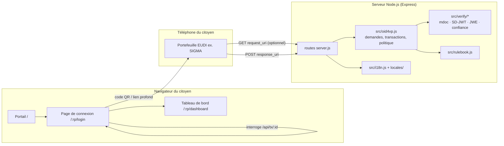
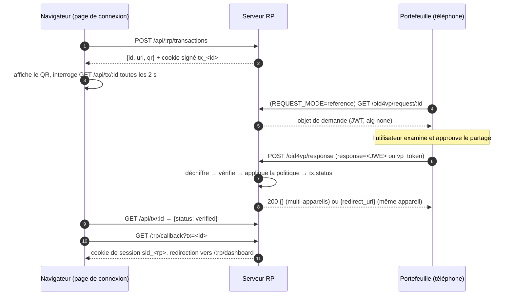

# Guide du développeur — PoC partie utilisatrice des eServices du Gouvernement du Bénin

*[English version: DEVELOPER.md](DEVELOPER.md)*

Ce guide s'adresse aux développeurs qui exécutent, modifient ou intègrent le
PoC. Le [README](../README.md) en est la version courte ; ce document explique
le fonctionnement du code et les raisons de sa conception.

---

## 1. Ce que fait le PoC

Le PoC est un **portail des eServices du Gouvernement** bilingue (anglais /
français). Deux sites de parties utilisatrices (RP) connectent les citoyens en
vérifiant une attestation présentée par un portefeuille compatible EUDI, via
**OpenID for Verifiable Presentations (OpenID4VP)** :

| Partie utilisatrice | Route | Attestation acceptée | Format |
|---|---|---|---|
| BEDC Electricity PLC | `/bedc` | PID du Bénin | **mdoc** ISO/IEC 18013-5, docType `eu.europa.ec.eudi.pid.1` |
| FDA Bénin / Ministère de la Santé | `/fda` | Attestation d'acte de naissance | **SD-JWT VC** (`dc+sd-jwt`) ; mdoc `eu.europa.ec.eudi.birth_certificate.1` également accepté |

Après une présentation réussie, la RP ouvre un tableau de bord fictif. Celui-ci
affiche les attributs communiqués et le résultat de chaque contrôle de
vérification.

Les profils d'attestation suivent le **Rulebook PID / Acte de naissance du
Bénin v1.1 (édition espace de noms standard)**.

> **Périmètre :** il s'agit d'une preuve de concept. Les tableaux de bord
> contiennent des données fictives, les sessions sont gardées en mémoire, et le
> site n'est pas un service officiel de la BEDC ou de la FDA. Lisez le
> [§12](#12-sécurité-et-limites) avant d'utiliser de vraies données
> personnelles.

---

## 2. Architecture



* **Un seul processus, sans base de données.** Les transactions (connexions en
  attente) et les sessions sont gardées en mémoire, dans des objets `Map`.
* **Pages rendues côté serveur.** Les pages sont des gabarits EJS. Seuls de
  petits scripts s'exécutent dans le navigateur : `public/js/login.js` et
  `public/js/wallet-test.js`.
* **Aucun service cryptographique externe.** Les vérifications de signature,
  les chaînes X.509, le CBOR/COSE et le déchiffrement JWE utilisent le module
  `crypto` de Node, plus `cbor-x` pour le CBOR.

### Dépendances d'exécution

| Paquet | Usage |
|---|---|
| `express` 5, `cookie-parser`, `ejs` | serveur web, cookies signés, gabarits |
| `qrcode` | génération des codes QR (data URL) |
| `cbor-x` | décodage et encodage CBOR des mdoc |
| `dotenv` | chargement du fichier `.env` |
| `@peculiar/x509`, `reflect-metadata` | **portefeuille de démonstration uniquement** : crée au démarrage les certificats simulés de l'IACA et du signataire de documents ANIP |

---

## 3. Organisation du projet

```
Benin poc/
├── server.js                 Application Express : portail, routes RP, points d'accès OpenID4VP
├── src/
│   ├── config.js             Tous les paramètres d'environnement (voir §5)
│   ├── rulebook.js           Constantes du rulebook et demandes d'attestation par RP
│   ├── oid4vp.js             Construction des demandes (DCQL/PEX, par valeur/référence, variantes),
│   │                         transactions, traitement des réponses, politique d'acceptation
│   ├── verify/
│   │   ├── mdoc.js           Vérification DeviceResponse ISO 18013-5 (COSE, MSO, DeviceAuth)
│   │   ├── sdjwt.js          Vérification SD-JWT VC + Key Binding JWT
│   │   ├── jwe.js            JWE ECDH-ES + A128GCM/A256GCM (réponses chiffrées)
│   │   ├── jose.js           Utilitaires JWS / signatures
│   │   └── trust.js          Ancres de confiance et validation des chaînes X.509
│   ├── demo/wallet.js        Émetteur ANIP et portefeuille simulés (DEMO_MODE, tests)
│   ├── dashboard-data.js     Données fictives déterministes des tableaux de bord
│   └── i18n.js               Middleware de choix de la langue
├── locales/en.json, fr.json  Tous les textes de l'interface (mêmes clés dans les deux fichiers)
├── views/                    Gabarits EJS (portail, connexion, test portefeuille, tableaux de bord, partiels)
├── public/                   CSS par marque, scripts navigateur, logos
├── trust/                    Certificats d'émetteurs / IACA de confiance (PEM, ignorés par git)
├── test/                     Suites node:test
└── docs/                     Ce guide et les captures d'écran
```

---

## 4. Prise en main

### 4.1 Exécution locale

Nécessite **Node.js 20 ou plus**.

```bash
cd "Benin poc"
npm install
cp .env.example .env
npm start          # http://localhost:3000
npm run dev        # idem, redémarre à chaque modification
npm test           # 25 tests
```

Ouvrez le portail, choisissez un service, puis cliquez sur **Démo : simuler le
portefeuille**. Le parcours complet s'exécute (demande, réponse chiffrée,
vérification, session, tableau de bord) avec des attestations de démonstration
signées par un émetteur ANIP simulé, créé au démarrage.

### 4.2 Tester avec un vrai portefeuille

Le portefeuille doit pouvoir joindre `<BASE_URL>/oid4vp/response` en HTTPS ;
`localhost` ne fonctionne donc pas avec un téléphone. Utilisez un tunnel
(`ngrok http 3000`) ou déployez (§4.3), puis renseignez `BASE_URL` avec cette
URL publique.

### 4.3 Déploiement sur Render.com

| Paramètre | Valeur |
|---|---|
| Root Directory | `Benin poc` (la racine du dépôt contient un ancien RP de test, sans lien) |
| Build / Start command | `npm install` / `npm start` |
| Environnement | `BASE_URL=https://<service>.onrender.com`, `SESSION_SECRET=<aléatoire>`, plus le profil portefeuille du §10 |

Remarques :

* Render définit lui-même `PORT`, et `trust proxy` est activé.
* Avec l'offre gratuite, le service se met en veille après environ 15 minutes
  sans trafic ; ouvrez le site peu avant une démonstration.
* L'état est gardé en mémoire : un redémarrage déconnecte tout le monde et
  invalide les codes QR en attente.

Vérifiez le déploiement avec `GET /health`, qui renvoie les valeurs effectives
de `baseUrl`, `responseUri` et `queryLanguage`.

---

## 5. Référence de configuration

Tous les paramètres sont des variables d'environnement, lues dans
`src/config.js`. `.env.example` documente chacune d'elles.

| Variable | Défaut | Signification |
|---|---|---|
| `BASE_URL` | `http://localhost:3000` | URL publique du serveur. L'hôte est converti en minuscules, car les portefeuilles comparent `client_id` et `response_uri` comme de simples chaînes. |
| `PORT` | `3000` | Port d'écoute |
| `CLIENT_ID` | `benin-eservices-rp.poc` | `client_id` OpenID4VP. Pour SIGMA : `redirect_uri:<BASE_URL>/oid4vp/response`. |
| `BEDC_CLIENT_ID`, `FDA_CLIENT_ID` | `CLIENT_ID` | Valeur propre à chaque RP |
| `CLIENT_ID_SCHEME` | *(vide)* | Envoie `client_id_scheme`, requis par certains portefeuilles antérieurs à la 1.0 |
| `QUERY_LANGUAGE` | `dcql` | `dcql` (`dcql_query` d'OpenID4VP 1.0) ou `pex` (`presentation_definition`) |
| `REQUEST_MODE` | `reference` | `reference` : QR court avec un `request_uri` non signé. `value` : tous les paramètres dans le QR. |
| `RESPONSE_MODE` | `direct_post.jwt` | `direct_post.jwt` : le portefeuille chiffre sa réponse, comme l'exige HAIP. `direct_post` : POST de formulaire en clair. |
| `CLIENT_METADATA` | `true` | Envoie les `client_metadata` complètes. Avec `false`, seuls la clé de chiffrement et `vp_formats_supported` sont envoyés (QR compact). |
| `WALLET_SCHEME` | `openid4vp://` | Schéma du lien profond (QR et bouton) |
| `REQUIRE_TRUSTED_ISSUER` | `false` | Rejette les émetteurs non rattachés à `trust/` |
| `REQUIRE_HOLDER_BINDING` | `false` | Rejette les présentations sans DeviceAuth / KB-JWT valide |
| `TRUST_DIR` | `./trust` | Dossier des ancres de confiance PEM |
| `TRUSTED_ISSUERS` | *(vide)* | Valeurs `iss` SD-JWT dont la clé peut être récupérée via `/.well-known/jwt-vc-issuer` |
| `BIRTH_CERT_VCTS` | 3 URI candidates | Valeurs `vct` SD-JWT acceptées pour l'acte de naissance |
| `BIRTH_CERT_COMPACT_FORMAT` | `dc+sd-jwt` | Format de l'acte de naissance dans la demande QR compacte, qui ne peut contenir qu'un seul format |
| `DEMO_MODE` | `true` | Affiche le bouton *simuler le portefeuille* et fait confiance à l'émetteur simulé. **À désactiver en production.** |
| `SESSION_SECRET` | aléatoire à chaque démarrage | Clé de signature des cookies. Fixez-la pour que les sessions survivent aux redémarrages. |

---

## 6. Parcours OpenID4VP

### 6.1 Séquence (multi-appareils, code QR)



**Parcours sur le même appareil :** l'utilisateur touche *Ouvrir le
portefeuille sur cet appareil*, et la page de connexion appelle
`POST /api/tx/:id/same-device`. Dans ce cas seulement, le serveur renvoie un
`redirect_uri` avec un `response_code` à usage unique, pour que le
portefeuille ramène le navigateur du téléphone vers la RP. Dans le parcours QR,
aucun `redirect_uri` n'est envoyé, car SIGMA y réagissait en affichant une
seconde fois l'écran de consentement.

### 6.2 Cycle de vie d'une transaction

Une transaction (`createTransaction` dans `src/oid4vp.js`) contient :

* un `state` et un `nonce`, tous deux aléatoires ;
* une valeur de cookie `browserKey`, qui lie la connexion au navigateur qui
  l'a lancée ;
* le `responseCode` du parcours sur le même appareil ;
* pour les réponses chiffrées, une **paire de clés de chiffrement P-256**
  nouvelle.

```
pending ──(réponse du portefeuille vérifiée)──▶ verified ──(callback)──▶ consumed
   │
   └──(erreur / politique non respectée / erreur portefeuille)──▶ rejected
walletStep : null → request_fetched → response_received   (affiché sur la page de connexion)
```

Les transactions expirent au bout de 10 minutes (`TX_TTL_MS`) et les sessions
au bout de 30 minutes (`LOGIN_TTL_MS`).

Un `state` ne peut servir qu'une fois. Si le même portefeuille renvoie une
réponse chiffrée avec la clé d'une transaction déjà terminée, le serveur en
accuse réception par `200 {}` sans la retraiter. Tout autre rejeu reçoit `400`.

### 6.3 Construction de la demande

`requestParameters(tx)` assemble les éléments suivants :

| Paramètre | Source |
|---|---|
| `response_type` | `vp_token` |
| `client_id` / `client_id_scheme` | configuration ou variante |
| `response_mode` | `direct_post.jwt` (défaut) ou `direct_post` |
| `response_uri` | `<BASE_URL>/oid4vp/response` |
| `nonce`, `state` | issus de la transaction |
| `dcql_query` ou `presentation_definition` | profil de la RP (§7) |
| `client_metadata` | `vp_formats_supported` est construit **à partir des formats réellement utilisés dans la requête**. Avec chiffrement, il contient aussi `jwks` (la clé de la transaction, avec `kid` et `alg: ECDH-ES`) et `encrypted_response_enc_values_supported`. |

**Transmission :**

* `REQUEST_MODE=reference` : le QR ne contient que `client_id` et
  `request_uri`. Le portefeuille récupère un objet de demande non signé
  (`application/oauth-authz-req+jwt`, `alg: none`).
* `REQUEST_MODE=value` : tous les paramètres sont dans l'URL. Ils sont encodés
  par `encodeQuery`, qui laisse `:` `/` `,` `@` lisibles pour réduire la taille
  du QR.

**Mode compact.** Lorsque la demande est transmise par valeur sans
métadonnées complètes, les réductions suivantes maintiennent le QR vers la
version 27 (~1 400 caractères), lisible par l'appareil photo d'un téléphone :

* `intent_to_retain` est omis ;
* seuls les algorithmes ES256 de HAIP sont listés ;
* pour la FDA, un seul format d'acte de naissance est demandé
  (`BIRTH_CERT_COMPACT_FORMAT`), avec les attributs de `compactClaims`.

À l'écran, les QR denses sont affichés en 440 px ; un toucher les affiche en
plein écran.

**Variantes** (`VARIANTS` dans `src/oid4vp.js`, utilisées par la page de test
du portefeuille) :

| Variante | client_id | Requête | Transmission | Réponse |
|---|---|---|---|---|
| `configured` | configuration | configuration | configuration | configuration |
| `legacy` | `CLIENT_ID` simple | PEX | valeur | `direct_post` |
| `dcql` | configuration | DCQL | référence | configuration |
| `redirect_uri` | `response_uri` + `client_id_scheme=redirect_uri` | PEX | valeur | configuration |
| `redirect_uri_prefix` | `redirect_uri:<response_uri>` | DCQL | valeur | `direct_post.jwt` |

### 6.4 Traitement de la réponse

`handleWalletResponse(body)` traite le POST du portefeuille comme suit :

1. **Chiffrée** (`response=<JWE>`) : lit le `kid` de l'en-tête JWE, retrouve la
   transaction propriétaire de cette clé, déchiffre le JWE
   (`src/verify/jwe.js`), puis vérifie que le `state` déchiffré correspond.
2. Rejette une réponse en clair si le chiffrement était demandé.
3. Enregistre un paramètre `error` du portefeuille sous la forme
   `wallet_error:<code>`.
4. Aplatit le `vp_token`, qu'il s'agisse d'une chaîne, d'un tableau ou d'un
   objet DCQL `{idAttestation: [présentations]}`.
5. Vérifie chaque présentation : une chaîne contenant `~` est un SD-JWT, tout
   le reste est une DeviceResponse en base64url.
6. Applique la politique d'acceptation (`evaluate`), décrite au §8.4.

---

## 7. Profils d'attestation (issus du rulebook)

Toutes les constantes du rulebook se trouvent dans `src/rulebook.js`.

| | BEDC (`bedc`) | FDA (`fda`) |
|---|---|---|
| Cas d'usage (Verifier Matrix) | Vérification d'identité | Corroboration de la date de naissance |
| Attestation principale | PID mdoc `eu.europa.ec.eudi.pid.1`, espace de noms `eu.europa.ec.eudi.pid.1` | Acte de naissance SD-JWT VC ; `vct` dans `BIRTH_CERT_VCTS` |
| Alternative | — | mdoc `eu.europa.ec.eudi.birth_certificate.1` (rulebook : « mdoc optionnel »), proposé via les `credential_sets` DCQL |
| Attributs demandés | `family_name, given_name, birth_date, nationality, issuing_authority, issuing_country, expiry_date` | `family_name, given_name, birth_date, birth_place, gender, birth_record_reference, issuing_authority, issuance_date` |
| Requis pour la connexion | `family_name, given_name, birth_date` | `family_name, given_name, birth_date` |
| Demande QR compacte | mêmes attributs | `family_name, given_name, birth_date, birth_record_reference` ; les `claim_sets` rendent `birth_record_reference` facultatif |

**Minimisation des données :** `portrait`, `resident_address`,
`personal_administrative_number` (NPI) et les noms des parents ne sont jamais
demandés.

> **Point ouvert :** le rulebook fixe le docType mdoc de l'acte de naissance,
> mais pas son `vct` SD-JWT. Le `vct` utilisé par l'émetteur de SIGMA doit être
> confirmé auprès d'IN Groupe, puis renseigné dans `BIRTH_CERT_VCTS`
> (voir §10).

---

## 8. Chaîne de vérification

Chaque présentation produit un objet résultat :

```js
{
  format,
  claims,
  vct | docType,
  issuer,
  checks: {
    credentialType, issuerSignature, trustedIssuer,
    disclosures, validity, holderBinding, status
  },
  errors
}
```

Chaque contrôle vaut `{ ok, detail }`. Le panneau *Attestation vérifiée* du
tableau de bord les affiche tous.

### 8.1 mdoc (`src/verify/mdoc.js`)

| Contrôle | Méthode |
|---|---|
| Signature de l'émetteur | COSE_Sign1 `issuerAuth` (`Sig_structure`, ES256/384/512, EdDSA) vérifié avec le certificat feuille de `x5chain` (label 33) |
| Émetteur de confiance | `x5chain` validée jusqu'à un certificat de `trust/` (`trust.js`) |
| Type d'attestation | `docType` du document = `docType` du MSO = docType attendu |
| Validité | `validityInfo.validFrom` du MSO ≤ maintenant ≤ `validUntil` |
| Intégrité des données | chaque `IssuerSignedItem` (tag 24) est haché et comparé à `valueDigests[namespace][digestID]` du MSO |
| Lien avec le détenteur | COSE_Sign1 `DeviceAuth` sur `DeviceAuthenticationBytes`, vérifié avec la clé d'appareil du MSO, pour chaque `SessionTranscript` candidat (ci-dessous) |

Les `SessionTranscript` candidats sont :

* l'`OpenID4VPHandover` d'OpenID4VP 1.0, avec l'**empreinte JWK** de la clé du
  vérificateur lorsque la réponse était chiffrée ;
* le même handover avec une empreinte `null` ;
* l'`OID4VPHandover` ISO 18013-7, construit avec le `mdocGeneratedNonce` issu
  du `apu` du JWE.

### 8.2 SD-JWT VC (`src/verify/sdjwt.js`)

| Contrôle | Méthode |
|---|---|
| Signature de l'émetteur | JWS vérifié avec le certificat feuille `x5c`, ou une clé issue de `<iss>/.well-known/jwt-vc-issuer` |
| Émetteur de confiance | chaîne `x5c` vérifiée avec `trust/`, ou `iss` présent dans `TRUSTED_ISSUERS` |
| Type d'attestation | `vct` ∈ `BIRTH_CERT_VCTS` |
| Intégrité des données | l'empreinte de chaque divulgation (`_sd_alg`, SHA-256 par défaut) doit figurer exactement une fois dans `_sd` ou `...`. Les divulgations injectées, dupliquées ou non référencées sont rejetées. |
| Validité | `exp` / `nbf`, avec une tolérance d'horloge de 60 s |
| Lien avec le détenteur | KB-JWT : `typ=kb+jwt`, signature par `cnf.jwk`, `nonce`, `aud` = client_id, `sd_hash`, `iat` de moins de 10 min |

### 8.3 Réponses chiffrées (`src/verify/jwe.js`)

* Prend en charge l'accord de clé direct **ECDH-ES**, avec un chiffrement du
  contenu **A128GCM / A256GCM** et la Concat KDF de la RFC 7518 §4.6.2. La KDF
  est testée avec le vecteur de test de l'annexe C de la RFC.
* Une nouvelle clé est générée pour chaque transaction et n'est jamais
  réutilisée.
* `encrypt()` n'existe que pour le portefeuille de démonstration et les tests.

### 8.4 Politique d'acceptation (`evaluate` dans `src/oid4vp.js`)

Une présentation est acceptée lorsque **toutes** les conditions suivantes sont
remplies :

* aucune erreur d'analyse ;
* `credentialType`, `issuerSignature`, `disclosures` et `validity` sont
  réussis ;
* le format est le format principal ou alternatif de la RP ;
* tous les attributs `required` sont présents ;
* si activés, `trustedIssuer` et `holderBinding` sont réussis
  (`REQUIRE_TRUSTED_ISSUER`, `REQUIRE_HOLDER_BINDING`).

Les motifs de rejet s'affichent sur la page de connexion et dans les journaux,
par exemple `check_failed:credentialType(<vct présenté>)`.

Les listes de statut **ne sont pas** vérifiées : le rulebook l'autorise pour le
PoC, et le contrôle est signalé comme `not_checked_poc`.

---

## 9. API HTTP

| Méthode et chemin | Appelant | Rôle |
|---|---|---|
| `GET /` | navigateur | Portail |
| `GET /health` | exploitation | `{ok, baseUrl, responseUri, queryLanguage}` |
| `GET /:rp` | navigateur | Redirige vers le tableau de bord si connecté, sinon vers la connexion |
| `GET /:rp/login` | navigateur | Page de connexion (`?error=expired\|rejected\|session&reason=…`) |
| `GET /:rp/wallet-test` | navigateur | Page de compatibilité du portefeuille : un QR par variante |
| `POST /api/:rp/transactions[?variant=]` | page de connexion | Crée une transaction. Renvoie `{id, uri, qr, variant, env}` et pose le cookie `tx_<id>`. |
| `GET /api/tx/:id` | page de connexion | `{status, reasons, walletStep}`. Ne fonctionne qu'avec le cookie du navigateur créateur. |
| `POST /api/tx/:id/same-device` | page de connexion | Marque la connexion comme « même appareil » |
| `POST /api/tx/:id/simulate` | page de connexion | Présentation du portefeuille de démonstration (`DEMO_MODE` uniquement) |
| `GET\|POST /oid4vp/request/:id` | portefeuille | Objet de demande (`request_uri`) |
| `POST /oid4vp/response` | portefeuille | `response_uri` : accepte `response=<JWE>` ou `vp_token` + `state` |
| `GET /:rp/callback?tx=&response_code=` | navigateur | Transforme une transaction vérifiée en session (cookie `sid_<rp>`) |
| `GET /:rp/dashboard` | navigateur | Tableau de bord (session requise) |
| `POST /:rp/logout` | navigateur | Termine la session |

`:rp` vaut `bedc` ou `fda`.

Chaque appel sous `/oid4vp/*` est journalisé avec le préfixe `[wallet]`. La
ligne de journal comprend le résumé du résultat : RP, variante, statut, motifs,
format et `vct`/docType présentés, et contrôles.

---

## 10. Notes d'intégration : SIGMA (IN Groupe)

SIGMA s'appuie sur la bibliothèque de référence européenne
`eudi-lib-jvm-openid4vp-kt` et applique le profil **HAIP**. Voici ses
exigences, découvertes une erreur de portefeuille à la fois :

| Erreur du portefeuille | Cause | Ce que fait désormais le PoC |
|---|---|---|
| Rien ne se passe après le scan | QR trop dense (version 35+), l'appareil photo ne peut pas le décoder | Demande compacte par valeur (~v27), affichage en 440 px, agrandissement au toucher |
| `MissingClientId` | Forme de demande non signée ou non prise en charge | Les demandes non signées utilisent le client_id `redirect_uri:<response_uri>` |
| *(bibliothèque)* `presentation_definition` ignoré | La bibliothèque ne prend en charge que DCQL | `QUERY_LANGUAGE=dcql` par défaut |
| `HAIP profile requires an encrypted response mode` | `direct_post` était utilisé | `direct_post.jwt` avec une clé ECDH-ES propre à chaque transaction |
| `ktor ClientRequestException 400 … already used state` | Un `redirect_uri` envoyé dans le parcours QR provoquait un second envoi | `redirect_uri` renvoyé uniquement pour le même appareil ; les envois répétés sont acquittés |
| `NoMatchingDocumentsException` | Le type d'attestation ou les attributs ne correspondent pas | Moins d'attributs obligatoires (`claim_sets`), alternative mdoc, `vct` configurable |
| `InvalidClientMetaData … does not support all Formats` | `vp_formats_supported` n'indiquait pas le format de la requête | Construit à partir des formats de la requête |

**Paramètres recommandés pour SIGMA :**

```
REQUEST_MODE=value
QUERY_LANGUAGE=dcql
CLIENT_ID=redirect_uri:https://<hôte>/oid4vp/response
CLIENT_METADATA=false
RESPONSE_MODE=direct_post.jwt
BIRTH_CERT_COMPACT_FORMAT=dc+sd-jwt
BIRTH_CERT_VCTS=<vct utilisé par l'émetteur SIGMA>   # à confirmer avec IN Groupe
```

**État au moment de la rédaction :**

* La demande PID mdoc est acceptée par SIGMA, qui affiche son écran de
  consentement et transmet la réponse chiffrée.
* L'acte de naissance attend encore le `vct` SD-JWT exact de l'émetteur.

**Vers la production avec SIGMA :** HAIP prévoit des **objets de demande
signés**, avec un client_id `x509_san_dns` ou `x509_hash`. Il faut pour cela un
certificat de vérificateur reconnu par le portefeuille, délivré ou approuvé
par IN Groupe. Une fois ce certificat disponible, la demande pourra revenir à
un QR `request_uri` court.

---

## 11. Faire évoluer le PoC

### Ajouter une partie utilisatrice

1. Ajoutez un profil dans `RELYING_PARTIES` (`src/rulebook.js`) avec :
   * `id`, `credential` (identifiant DCQL), `format`, et
     `docType`/`namespace` ou `vcts` ;
   * `claims` et `required` ;
   * éventuellement `alternative`, `claimSets` et `compactClaims`.
2. Ajoutez une entrée de marque dans `BRANDS` (`server.js`) : nom, logo, icône,
   CSS et éléments de navigation.
3. Créez `views/partials/header-<id>.ejs`, `views/<id>-dashboard.ejs` et
   `public/css/<id>.css` (variables CSS `--primary`, `--accent`, …).
4. Ajoutez le générateur de données fictives dans `src/dashboard-data.js`.
5. Ajoutez chaque nouveau texte d'interface dans **les deux** fichiers
   `locales/en.json` et `locales/fr.json`. Un test échoue si les clés
   diffèrent.
6. Ajoutez une carte dans `views/portal.ejs`.

### Ajouter une langue

1. Créez `locales/<code>.json` avec les mêmes clés que `en.json`.
2. Ajoutez le code à `SUPPORTED` dans `src/i18n.js`.

La langue est choisie dans cet ordre : `?lang=` (mémorisé dans un cookie), le
cookie, `Accept-Language`, puis l'anglais.

### Modifier les attributs demandés

Modifiez `claims` / `required` / `compactClaims` dans `src/rulebook.js`. Après
la modification :

* revérifiez la taille du QR avec la commande du §13 ;
* respectez la minimisation des données selon la *Verifier Matrix* du
  rulebook.

### Portefeuille de démonstration

`src/demo/wallet.js` émet et présente des attestations conformes au rulebook.
Il utilise les personnes de démonstration de la feuille *Benin Display
Simulation* du rulebook : **KOSSI Jean** pour le PID et **HOUNGBEDJI
Angélique** pour l'acte de naissance.

* Au démarrage, il crée une IACA et un signataire ANIP simulés, et enregistre
  l'IACA comme ancre de confiance.
* `respond(tx, rp)` construit exactement ce qu'un portefeuille enverrait, y
  compris la mise en forme DCQL et le chiffrement JWE.

---

## 12. Sécurité et limites

**Mis en place :**

* `state`/`nonce` à usage unique pour chaque transaction ;
* transactions liées au navigateur par des cookies signés HttpOnly
  (`SameSite=Lax`, `Secure` en HTTPS) ;
* `response_code` pour le parcours sur le même appareil ;
* une clé de chiffrement de réponse distincte pour chaque transaction ;
* vérification complète des signatures, empreintes et liens avec le
  détenteur ;
* en-têtes de sécurité (`nosniff`, `X-Frame-Options: DENY`,
  `Referrer-Policy`) ;
* aucune donnée personnelle dans les journaux `[wallet]`.

**Avant d'utiliser de vraies données de citoyens :**

* Réglez `DEMO_MODE=false`, `REQUIRE_TRUSTED_ISSUER=true` et
  `REQUIRE_HOLDER_BINDING=true`.
* Déployez les ancres de confiance ANIP dans `trust/`. Utilisez les fichiers
  secrets de l'hébergeur ; ne les versionnez pas.
* Utilisez des objets de demande signés (`x509_san_dns` / `x509_hash`) avec un
  certificat de vérificateur enregistré.
* Vérifiez la révocation (Token Status List).
* Déplacez transactions et sessions vers Redis ou une base de données, et
  fixez `SESSION_SECRET`.
* Remplacez les tableaux de bord fictifs, et retirez les logos tiers sauf
  autorisation de la BEDC et de la FDA.

---

## 13. Dépannage

* **Page de test du portefeuille** (`/:rp/wallet-test`) : chaque carte affiche
  une variante de demande différente.
  * Orange : le portefeuille a récupéré la demande ou y a répondu.
  * Vert : la connexion est vérifiée. La carte indique les variables
    d'environnement qui font de cette variante la valeur par défaut.
  * Rouge : rejet, avec les motifs.
* **Journaux Render :**
  * `[wallet] GET /oid4vp/request/... -> 200` : le portefeuille a lu la
    demande.
  * `[wallet] response keys=response -> 200 {...}` : la réponse a été reçue ;
    le résumé suit.
* **Aucune ligne `[wallet]` :** le portefeuille n'a jamais contacté le
  serveur. Vérifiez la taille du QR (agrandissez-le), `WALLET_SCHEME` et
  `BASE_URL`.
* **Mesurer la taille du QR** pour la configuration courante :

  ```bash
  node -e "const o=require('./src/oid4vp');const QR=require('qrcode');for(const rp of ['bedc','fda']){const {uri}=o.authorizationRequest(o.createTransaction(rp));console.log(rp,uri.length,'caractères, QR v'+QR.create(uri,{errorCorrectionLevel:'L'}).version)}"
  ```

  Restez vers la version 27 ou moins pour un scan à l'appareil photo.

### Tests

`npm test` exécute 25 tests `node:test` :

* les deux vérificateurs sur des présentations valides ;
* les cas de falsification : divulgation injectée, élément mdoc modifié,
  mauvais nonce, mauvais vérificateur, mauvaise attestation pour la RP, rejeu,
  mauvaise clé de chiffrement, réponse non chiffrée ;
* le JWE et le vecteur KDF de la RFC 7518 ;
* chaque variante de demande de bout en bout ;
* la cohérence de `vp_formats_supported` ;
* le parcours web : portail, changement de langue, connexion, tableau de bord,
  liaison au navigateur ;
* l'identité des clés de traduction EN/FR.
