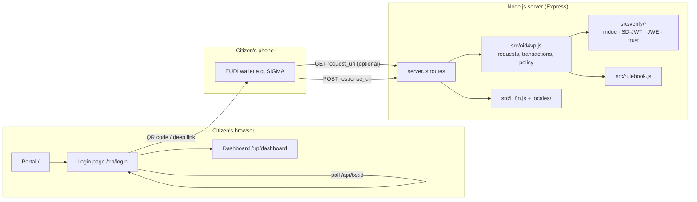
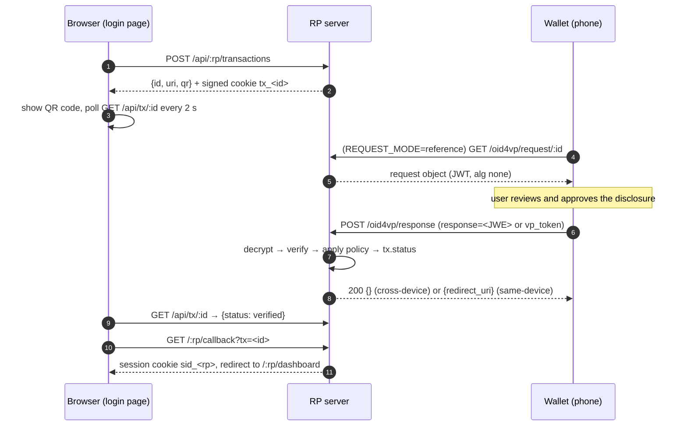

# Developer Guide — Benin Government eServices Relying Party PoC

*[Version française : DEVELOPER.fr.md](DEVELOPER.fr.md)*

This guide is for developers who run, change or integrate the PoC. The
[README](../README.md) is the short version; this document explains how the
code works and why it is built the way it is.

---

## 1. What the PoC does

The PoC is a bilingual (English / French) **Government eServices portal**. Two
relying-party (RP) websites sign citizens in by verifying a credential from
an EUDI-compatible wallet over **OpenID for Verifiable Presentations
(OpenID4VP)**:

| Relying party | Route | Credential accepted | Format |
|---|---|---|---|
| BEDC Electricity PLC | `/bedc` | Benin PID | ISO/IEC 18013-5 **mdoc**, docType `eu.europa.ec.eudi.pid.1` |
| FDA Benin / Ministry of Health | `/fda` | Birth Certificate attestation | **SD-JWT VC** (`dc+sd-jwt`); mdoc `eu.europa.ec.eudi.birth_certificate.1` also accepted |

After a successful presentation, the RP opens a dummy dashboard. The dashboard
shows the disclosed attributes and the result of every verification check.

The credential profiles follow the **Benin PID / Birth Certificate Rulebook
v1.1 (Standard-Namespace Edition)**.

> **Scope:** this is a proof of concept. Dashboards contain dummy data,
> sessions are kept in memory, and the site is not an official BEDC or FDA
> service. See [§12](#12-security-notes-and-limitations) before you use real
> personal data.

---

## 2. Architecture



* **One process, no database.** Transactions (pending logins) and sessions
  live in memory, in `Map` objects.
* **Server-rendered pages.** The pages are EJS templates. Only small scripts
  run in the browser: `public/js/login.js` and `public/js/wallet-test.js`.
* **No external crypto services.** Signature checks, X.509 chains, CBOR/COSE
  and JWE decryption use Node's `crypto`, plus `cbor-x` for CBOR.

### Runtime dependencies

| Package | Used for |
|---|---|
| `express` 5, `cookie-parser`, `ejs` | web server, signed cookies, templates |
| `qrcode` | QR code rendering (data URL) |
| `cbor-x` | mdoc CBOR decoding and encoding |
| `dotenv` | `.env` loading |
| `@peculiar/x509`, `reflect-metadata` | **demo wallet only**: creates the simulated ANIP IACA and document-signer certificates at start-up |

---

## 3. Project layout

```
Benin poc/
├── server.js                 Express app: portal, RP routes, OpenID4VP endpoints
├── src/
│   ├── config.js             All environment settings (see §5)
│   ├── rulebook.js           Rulebook constants and per-RP credential requests
│   ├── oid4vp.js             Request building (DCQL/PEX, by value/reference, variants),
│   │                         transactions, response handling, acceptance policy
│   ├── verify/
│   │   ├── mdoc.js           ISO 18013-5 DeviceResponse verification (COSE, MSO, DeviceAuth)
│   │   ├── sdjwt.js          SD-JWT VC + Key Binding JWT verification
│   │   ├── jwe.js            JWE ECDH-ES + A128GCM/A256GCM (encrypted responses)
│   │   ├── jose.js           JWS / signature helpers
│   │   └── trust.js          Trust anchors and X.509 chain validation
│   ├── demo/wallet.js        Simulated ANIP issuer and wallet (DEMO_MODE, tests)
│   ├── dashboard-data.js     Deterministic dummy dashboard data
│   └── i18n.js               Language selection middleware
├── locales/en.json, fr.json  All UI strings (both files must have the same keys)
├── views/                    EJS templates (portal, login, wallet-test, dashboards, partials)
├── public/                   CSS per brand, browser scripts, logos
├── trust/                    Trusted issuer / IACA certificates (PEM, git-ignored)
├── test/                     node:test suites
└── docs/                     This guide and screenshots
```

---

## 4. Getting started

### 4.1 Run locally

Requires **Node.js 20 or later**.

```bash
cd "Benin poc"
npm install
cp .env.example .env
npm start          # http://localhost:3000
npm run dev        # same, restarts on file changes
npm test           # 25 tests
```

Open the portal, choose a service, and click **Demo: simulate wallet**. This
runs the full flow (request, encrypted response, verification, session,
dashboard) with demo credentials signed by a simulated ANIP issuer that is
created at start-up.

### 4.2 Testing with a real wallet

The wallet must reach `<BASE_URL>/oid4vp/response` over HTTPS, so `localhost`
does not work with a phone. Use a tunnel (`ngrok http 3000`) or deploy (§4.3),
then set `BASE_URL` to that public URL.

### 4.3 Deploying on Render.com

| Setting | Value |
|---|---|
| Root Directory | `Benin poc` (the repository root holds an older, unrelated test RP) |
| Build / Start command | `npm install` / `npm start` |
| Environment | `BASE_URL=https://<service>.onrender.com`, `SESSION_SECRET=<random>`, plus the wallet profile from §10 |

Notes:

* Render sets `PORT` itself, and `trust proxy` is enabled.
* On the free plan the service sleeps after about 15 minutes without traffic,
  so open the site shortly before a demo.
* State is kept in memory, so a restart signs everyone out and drops any
  pending QR codes.

Check the deployment at `GET /health`. It returns the effective `baseUrl`,
`responseUri` and `queryLanguage`.

---

## 5. Configuration reference

All settings are environment variables, read in `src/config.js`.
`.env.example` documents each one.

| Variable | Default | Meaning |
|---|---|---|
| `BASE_URL` | `http://localhost:3000` | Public URL of the server. The host is lower-cased, because wallets compare `client_id` and `response_uri` as plain strings. |
| `PORT` | `3000` | Listening port |
| `CLIENT_ID` | `benin-eservices-rp.poc` | OpenID4VP `client_id`. For SIGMA, use `redirect_uri:<BASE_URL>/oid4vp/response`. |
| `BEDC_CLIENT_ID`, `FDA_CLIENT_ID` | `CLIENT_ID` | Per-RP override |
| `CLIENT_ID_SCHEME` | *(empty)* | Sends `client_id_scheme`, needed by some pre-1.0 wallets |
| `QUERY_LANGUAGE` | `dcql` | `dcql` (OpenID4VP 1.0 `dcql_query`) or `pex` (`presentation_definition`) |
| `REQUEST_MODE` | `reference` | `reference`: short QR code with an unsigned `request_uri`. `value`: all parameters in the QR code. |
| `RESPONSE_MODE` | `direct_post.jwt` | `direct_post.jwt`: the wallet encrypts its response, as HAIP requires. `direct_post`: plain form POST. |
| `CLIENT_METADATA` | `true` | Sends full `client_metadata`. With `false`, only the encryption key and `vp_formats_supported` are sent (compact QR). |
| `WALLET_SCHEME` | `openid4vp://` | Deep-link scheme in the QR code and button |
| `REQUIRE_TRUSTED_ISSUER` | `false` | Rejects issuers that don't chain to `trust/` |
| `REQUIRE_HOLDER_BINDING` | `false` | Rejects presentations without valid DeviceAuth / KB-JWT |
| `TRUST_DIR` | `./trust` | Folder of PEM trust anchors |
| `TRUSTED_ISSUERS` | *(empty)* | SD-JWT `iss` values whose keys may be fetched from `/.well-known/jwt-vc-issuer` |
| `BIRTH_CERT_VCTS` | 3 candidate URIs | Accepted SD-JWT `vct` values for the birth certificate |
| `BIRTH_CERT_COMPACT_FORMAT` | `dc+sd-jwt` | Birth certificate format in the compact QR request, which has room for one format only |
| `DEMO_MODE` | `true` | Shows the *simulate wallet* button and trusts the simulated issuer. **Disable in production.** |
| `SESSION_SECRET` | random per start | Cookie signing key. Set it so that sessions survive restarts. |

---

## 6. OpenID4VP flow

### 6.1 Sequence (cross-device, QR code)



**Same-device flow:** the user taps *Open wallet on this device*, and the login
page calls `POST /api/tx/:id/same-device`. Only in that case does the server
return a `redirect_uri` with a one-time `response_code`, so that the wallet
sends the phone's browser back to the RP. In the QR flow no `redirect_uri` is
sent, because SIGMA reacted to it by showing its consent screen a second time.

### 6.2 Transaction lifecycle

A transaction (`createTransaction` in `src/oid4vp.js`) holds:

* `state` and `nonce`, both random;
* a `browserKey` cookie value, which binds the login to the browser that
  started it;
* the `responseCode` for the same-device flow;
* for encrypted responses, a fresh **P-256 encryption key pair**.

```
pending ──(wallet response verified)──▶ verified ──(callback)──▶ consumed
   │
   └──(error / failed policy / wallet error)──▶ rejected
walletStep: null → request_fetched → response_received   (shown on the login page)
```

Transactions expire after 10 minutes (`TX_TTL_MS`) and login sessions after
30 minutes (`LOGIN_TTL_MS`).

A state can only be used once. If the same wallet re-sends a response
encrypted to a finished transaction's key, the server acknowledges it with
`200 {}` and doesn't process it again. Any other replay gets `400`.

### 6.3 Building the request

`requestParameters(tx)` assembles the following:

| Parameter | Source |
|---|---|
| `response_type` | `vp_token` |
| `client_id` / `client_id_scheme` | from config or the variant |
| `response_mode` | `direct_post.jwt` (default) or `direct_post` |
| `response_uri` | `<BASE_URL>/oid4vp/response` |
| `nonce`, `state` | from the transaction |
| `dcql_query` or `presentation_definition` | from the RP profile (§7) |
| `client_metadata` | `vp_formats_supported` is built **from the formats actually used in the query**. With encryption it also carries `jwks` (the transaction key, with `kid` and `alg: ECDH-ES`) and `encrypted_response_enc_values_supported`. |

**Delivery:**

* `REQUEST_MODE=reference`: the QR code holds only `client_id` and
  `request_uri`. The wallet fetches an unsigned request object
  (`application/oauth-authz-req+jwt`, `alg: none`).
* `REQUEST_MODE=value`: all parameters go in the URL. They are encoded with
  `encodeQuery`, which leaves `:` `/` `,` `@` readable to keep the QR code
  smaller.

**Compact mode.** When the request is sent by value without full metadata, the
following reductions keep the QR code at about version 27 (~1,400 characters),
which a phone camera can read:

* `intent_to_retain` is omitted.
* Only HAIP's ES256 algorithms are listed.
* For the FDA, only one birth certificate format is requested
  (`BIRTH_CERT_COMPACT_FORMAT`), with the claims in `compactClaims`.

On screen, dense QR codes are shown at 440 px; tapping one shows it full screen.

**Variants** (`VARIANTS` in `src/oid4vp.js`, used by the wallet test page):

| Variant | client_id | Query | Delivery | Response |
|---|---|---|---|---|
| `configured` | from config | from config | from config | from config |
| `legacy` | bare `CLIENT_ID` | PEX | value | `direct_post` |
| `dcql` | from config | DCQL | reference | from config |
| `redirect_uri` | `response_uri` + `client_id_scheme=redirect_uri` | PEX | value | from config |
| `redirect_uri_prefix` | `redirect_uri:<response_uri>` | DCQL | value | `direct_post.jwt` |

### 6.4 Handling the response

`handleWalletResponse(body)` processes the wallet's POST as follows:

1. **Encrypted** (`response=<JWE>`): reads the JWE header `kid`, finds the
   transaction that owns that key, decrypts the JWE (`src/verify/jwe.js`), and
   checks that the decrypted `state` matches.
2. Rejects an unencrypted response if encryption was requested.
3. Records a wallet `error` parameter as `wallet_error:<code>`.
4. Flattens `vp_token`, whether it is a string, an array, or a DCQL object
   `{credentialId: [presentations]}`.
5. Verifies each presentation: a string containing `~` is an SD-JWT, anything
   else is a base64url DeviceResponse.
6. Applies the acceptance policy (`evaluate`), described in §8.4.

---

## 7. Credential profiles (from the rulebook)

All rulebook constants live in `src/rulebook.js`.

| | BEDC (`bedc`) | FDA (`fda`) |
|---|---|---|
| Verifier Matrix use case | Identity verification | Birth-date corroboration |
| Primary credential | PID mdoc `eu.europa.ec.eudi.pid.1`, namespace `eu.europa.ec.eudi.pid.1` | Birth Certificate SD-JWT VC; `vct` in `BIRTH_CERT_VCTS` |
| Alternative | — | mdoc `eu.europa.ec.eudi.birth_certificate.1` (rulebook: "mdoc optional"), offered through DCQL `credential_sets` |
| Claims requested | `family_name, given_name, birth_date, nationality, issuing_authority, issuing_country, expiry_date` | `family_name, given_name, birth_date, birth_place, gender, birth_record_reference, issuing_authority, issuance_date` |
| Required for login | `family_name, given_name, birth_date` | `family_name, given_name, birth_date` |
| Compact QR request | same claims | `family_name, given_name, birth_date, birth_record_reference`, with `claim_sets` making `birth_record_reference` optional |

**Data minimisation:** `portrait`, `resident_address`,
`personal_administrative_number` (NPI) and the parents' names are never
requested.

> **Open point:** the rulebook fixes the birth certificate's mdoc docType, but
> not its SD-JWT `vct`. The `vct` that SIGMA's issuer uses must be confirmed
> with IN Groupe, then set in `BIRTH_CERT_VCTS` (see §10).

---

## 8. Verification pipeline

Every presentation produces a result object:

```js
{
  format,
  claims,
  vct | docType,
  issuer,
  checks: {
    credentialType, issuerSignature, trustedIssuer,
    disclosures, validity, holderBinding, status
  },
  errors
}
```

Each check is `{ ok, detail }`. The dashboard's *Verified credential* panel
shows all of them.

### 8.1 mdoc (`src/verify/mdoc.js`)

| Check | How |
|---|---|
| Issuer signature | COSE_Sign1 `issuerAuth` (`Sig_structure`, ES256/384/512, EdDSA) verified against the leaf of `x5chain` (label 33) |
| Trusted issuer | `x5chain` validated up to a certificate in `trust/` (`trust.js`) |
| Credential type | document `docType` = MSO `docType` = expected docType |
| Validity | MSO `validityInfo.validFrom` ≤ now ≤ `validUntil` |
| Data integrity | each `IssuerSignedItem` (tag 24) is hashed and compared with MSO `valueDigests[namespace][digestID]` |
| Holder binding | `DeviceAuth` COSE_Sign1 over `DeviceAuthenticationBytes`, checked with the MSO device key, for each candidate `SessionTranscript` (below) |

The candidate `SessionTranscript` values are:

* OpenID4VP 1.0 `OpenID4VPHandover`, with the verifier key's **JWK
  thumbprint** when the response was encrypted;
* the same handover with a `null` thumbprint;
* the ISO 18013-7 `OID4VPHandover`, built with the `mdocGeneratedNonce` from
  the JWE `apu`.

### 8.2 SD-JWT VC (`src/verify/sdjwt.js`)

| Check | How |
|---|---|
| Issuer signature | JWS checked with the `x5c` leaf, or a key from `<iss>/.well-known/jwt-vc-issuer` |
| Trusted issuer | `x5c` chain against `trust/`, or `iss` listed in `TRUSTED_ISSUERS` |
| Credential type | `vct` ∈ `BIRTH_CERT_VCTS` |
| Data integrity | every disclosure's digest (`_sd_alg`, default SHA-256) must appear exactly once in `_sd` or `...`. Injected, duplicated or unreferenced disclosures are rejected. |
| Validity | `exp` / `nbf`, with 60 s clock skew |
| Holder binding | KB-JWT: `typ=kb+jwt`, signature by `cnf.jwk`, `nonce`, `aud` = client_id, `sd_hash`, `iat` within 10 min |

### 8.3 Encrypted responses (`src/verify/jwe.js`)

* Supports **ECDH-ES** direct key agreement, with **A128GCM / A256GCM** content
  encryption and the Concat KDF of RFC 7518 §4.6.2. The KDF is unit-tested
  against the RFC's Appendix C test vector.
* A new key is generated for each transaction and is never reused.
* `encrypt()` exists only for the demo wallet and the tests.

### 8.4 Acceptance policy (`evaluate` in `src/oid4vp.js`)

A presentation is accepted when **all** of the following hold:

* there are no parsing errors;
* `credentialType`, `issuerSignature`, `disclosures` and `validity` pass;
* the format is the RP's primary or alternative format;
* every `required` claim is present;
* if enabled, `trustedIssuer` and `holderBinding` pass
  (`REQUIRE_TRUSTED_ISSUER`, `REQUIRE_HOLDER_BINDING`).

Rejection reasons are shown on the login page and in the logs, for example
`check_failed:credentialType(<presented vct>)`.

Status lists are **not** checked: the rulebook allows this for the PoC, and
the check is reported as `not_checked_poc`.

---

## 9. HTTP API

| Method & path | Caller | Purpose |
|---|---|---|
| `GET /` | browser | Portal |
| `GET /health` | ops | `{ok, baseUrl, responseUri, queryLanguage}` |
| `GET /:rp` | browser | Redirects to the dashboard if signed in, otherwise to login |
| `GET /:rp/login` | browser | Login page (`?error=expired\|rejected\|session&reason=…`) |
| `GET /:rp/wallet-test` | browser | Wallet compatibility page: one QR code per variant |
| `POST /api/:rp/transactions[?variant=]` | login page | Creates a transaction. Returns `{id, uri, qr, variant, env}` and sets the `tx_<id>` cookie. |
| `GET /api/tx/:id` | login page | `{status, reasons, walletStep}`. Works only with the creating browser's cookie. |
| `POST /api/tx/:id/same-device` | login page | Marks the login as same-device |
| `POST /api/tx/:id/simulate` | login page | Demo wallet presentation (`DEMO_MODE` only) |
| `GET\|POST /oid4vp/request/:id` | wallet | Request object (`request_uri`) |
| `POST /oid4vp/response` | wallet | `response_uri`: accepts `response=<JWE>` or `vp_token` + `state` |
| `GET /:rp/callback?tx=&response_code=` | browser | Turns a verified transaction into a session (`sid_<rp>` cookie) |
| `GET /:rp/dashboard` | browser | Dashboard (session required) |
| `POST /:rp/logout` | browser | Ends the session |

`:rp` is `bedc` or `fda`.

Every call under `/oid4vp/*` is logged with a `[wallet]` prefix. The log line
includes the outcome summary: RP, variant, status, reasons, the presented
format and `vct`/docType, and the checks.

---

## 10. Wallet integration notes: SIGMA (IN Groupe)

SIGMA is built on the EU reference library `eudi-lib-jvm-openid4vp-kt` and
applies the **HAIP** profile. These are its requirements, learned one wallet
error at a time:

| Wallet error | Cause | What the PoC does now |
|---|---|---|
| Nothing happens after scanning | QR code too dense (version 35+), so the camera can't decode it | Compact by-value request (~v27), 440 px display, tap to enlarge |
| `MissingClientId` | Unsigned or unsupported request shape | Unsigned requests use the `redirect_uri:<response_uri>` client_id |
| *(library)* `presentation_definition` ignored | The library supports DCQL only | `QUERY_LANGUAGE=dcql` by default |
| `HAIP profile requires an encrypted response mode` | `direct_post` was used | `direct_post.jwt` with a per-transaction ECDH-ES key |
| `ktor ClientRequestException 400 … already used state` | A `redirect_uri` sent in the QR flow made the wallet re-submit | `redirect_uri` is returned for same-device only; repeats are acknowledged |
| `NoMatchingDocumentsException` | Credential type or claims don't match | Fewer mandatory claims (`claim_sets`), mdoc alternative, configurable `vct` |
| `InvalidClientMetaData … does not support all Formats` | `vp_formats_supported` didn't list the query's format | Built from the query's formats |

**Recommended settings for SIGMA:**

```
REQUEST_MODE=value
QUERY_LANGUAGE=dcql
CLIENT_ID=redirect_uri:https://<host>/oid4vp/response
CLIENT_METADATA=false
RESPONSE_MODE=direct_post.jwt
BIRTH_CERT_COMPACT_FORMAT=dc+sd-jwt
BIRTH_CERT_VCTS=<vct used by the SIGMA issuer>   # to be confirmed with IN Groupe
```

**Status at the time of writing:**

* The PID mdoc request is accepted by SIGMA. SIGMA shows its consent screen
  and submits the encrypted response.
* The birth certificate is still waiting for the issuer's exact SD-JWT `vct`.

**Toward production with SIGMA:** HAIP expects **signed request objects** with
an `x509_san_dns` or `x509_hash` client_id. That needs a verifier certificate
the wallet trusts, issued or approved by IN Groupe. Once it exists, the
request can go back to a short `request_uri` QR code.

---

## 11. Extending the PoC

### Add a relying party

1. Add a profile in `RELYING_PARTIES` (`src/rulebook.js`) with:
   * `id`, `credential` (the DCQL id), `format`, and `docType`/`namespace` or
     `vcts`;
   * `claims` and `required`;
   * optionally `alternative`, `claimSets` and `compactClaims`.
2. Add a brand entry in `BRANDS` (`server.js`): name, logo, icon, CSS and nav
   items.
3. Create `views/partials/header-<id>.ejs`, `views/<id>-dashboard.ejs` and
   `public/css/<id>.css` (CSS variables `--primary`, `--accent`, …).
4. Add the dummy data generator in `src/dashboard-data.js`.
5. Add every new UI string to **both** `locales/en.json` and `locales/fr.json`.
   A test fails if the key sets differ.
6. Add a card on `views/portal.ejs`.

### Add a language

1. Create `locales/<code>.json` with the same keys as `en.json`.
2. Add the code to `SUPPORTED` in `src/i18n.js`.

The language is chosen in this order: `?lang=` (saved in a cookie), the cookie,
`Accept-Language`, then English.

### Change requested claims

Edit `claims` / `required` / `compactClaims` in `src/rulebook.js`. After the
change:

* re-check the QR code size with the snippet in §13;
* keep data minimisation in line with the rulebook's Verifier Matrix.

### Demo wallet

`src/demo/wallet.js` issues and presents rulebook-conformant credentials. It
uses the demo personas from the rulebook's *Benin Display Simulation* sheet:
**KOSSI Jean** for the PID and **HOUNGBEDJI Angélique** for the birth
certificate.

* At start-up it creates a simulated ANIP IACA and document signer, and
  registers the IACA as a trust anchor.
* `respond(tx, rp)` builds exactly what a wallet would POST, including DCQL
  shaping and JWE encryption.

---

## 12. Security notes and limitations

**Implemented:**

* one-time `state`/`nonce` per transaction;
* transactions bound to the browser with signed HttpOnly cookies
  (`SameSite=Lax`, `Secure` on HTTPS);
* `response_code` for the same-device flow;
* a separate response-encryption key per transaction;
* full signature, digest and holder-binding verification;
* security headers (`nosniff`, `X-Frame-Options: DENY`, `Referrer-Policy`);
* no personal data in the `[wallet]` logs.

**Before using real citizen data:**

* Set `DEMO_MODE=false`, `REQUIRE_TRUSTED_ISSUER=true` and
  `REQUIRE_HOLDER_BINDING=true`.
* Deploy the ANIP trust anchors in `trust/`. Use your host's secret files;
  don't commit them.
* Use signed request objects (`x509_san_dns` / `x509_hash`) with a registered
  verifier certificate.
* Check revocation (Token Status List).
* Move transactions and sessions to Redis or a database, and set a fixed
  `SESSION_SECRET`.
* Replace the dummy dashboards, and remove the third-party logos unless BEDC
  and the FDA have authorised their use.

---

## 13. Troubleshooting

* **Wallet test page** (`/:rp/wallet-test`): each card shows a different
  request variant.
  * Amber: the wallet fetched or answered the request.
  * Green: the login verified. The card lists the env vars that make that
    variant the default.
  * Red: rejected, with the reasons.
* **Render logs:**
  * `[wallet] GET /oid4vp/request/... -> 200`: the wallet read the request.
  * `[wallet] response keys=response -> 200 {...}`: the response was
    received; the summary follows.
* **No `[wallet]` line at all:** the wallet never contacted the server. Check
  the QR size (tap to enlarge), `WALLET_SCHEME`, and `BASE_URL`.
* **Measure QR size** for the current settings:

  ```bash
  node -e "const o=require('./src/oid4vp');const QR=require('qrcode');for(const rp of ['bedc','fda']){const {uri}=o.authorizationRequest(o.createTransaction(rp));console.log(rp,uri.length,'chars, QR v'+QR.create(uri,{errorCorrectionLevel:'L'}).version)}"
  ```

  Keep it at about version 27 or lower for camera scanning.

### Tests

`npm test` runs 25 `node:test` tests:

* both verifiers on valid presentations;
* tampering cases: injected disclosure, altered mdoc element, wrong nonce,
  wrong verifier, wrong credential for the RP, replay, wrong encryption key,
  unencrypted response;
* JWE and the RFC 7518 KDF vector;
* every request variant end to end;
* `vp_formats_supported` consistency;
* the web flow: portal, language switch, login, dashboard, browser binding;
* identical EN/FR translation keys.
