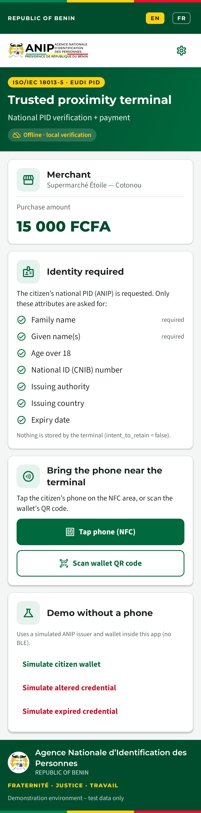
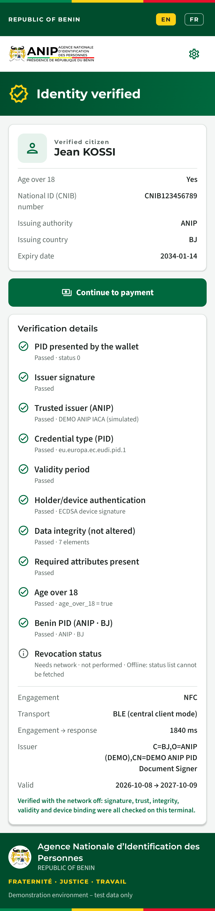
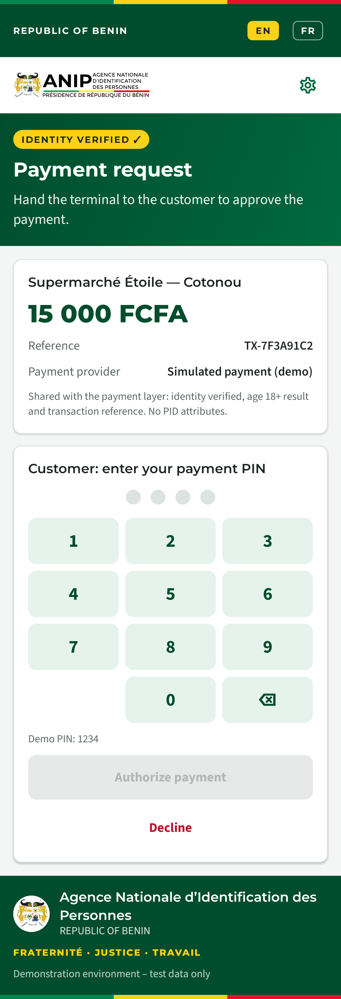
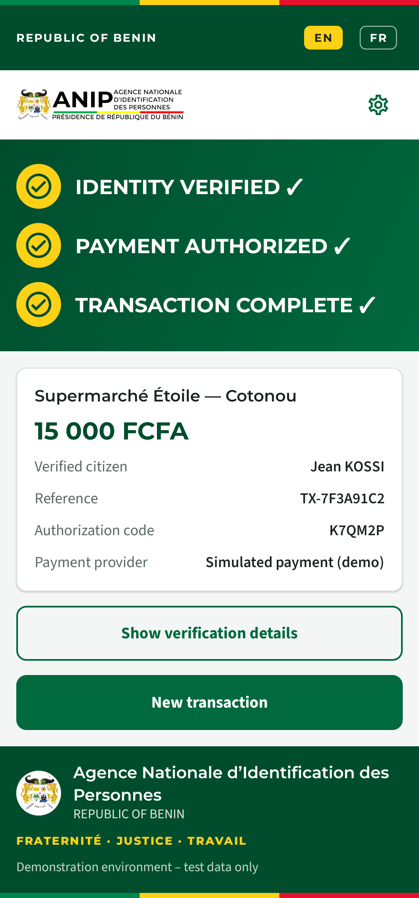
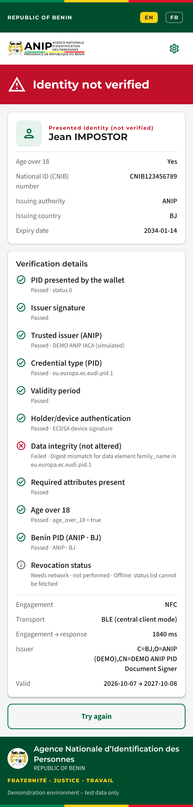
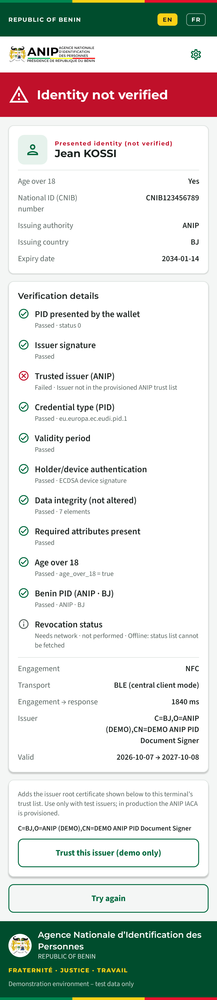
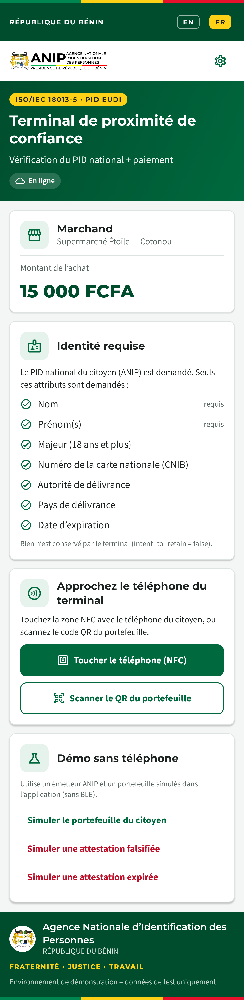
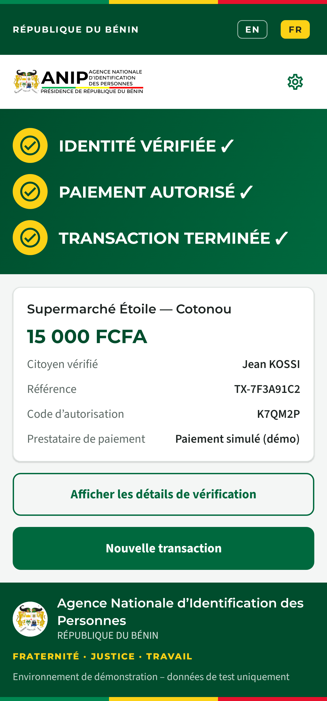

# ANIP Proximity POS — PID verification + payment (Android)

**English** · [Français](#terminal-de-proximité-anip--vérification-pid--paiement-android)

Android point-of-sale (POS) verifier for the scenario in
*Proximity_PID_Payment_Developer_Requirements*: a citizen pays in a shop and
proves their identity in person with the **Benin PID mdoc** in their EUDI wallet
(ISO/IEC 18013-5), then explicitly confirms the payment. It uses the ANIP / CIVIC
portal branding (green `#00693e`, Benin tricolour, Montserrat / Source Sans 3,
ANIP logo and arms) and is bilingual EN/FR.

| Home (POS) | Identity verified | Payment | Transaction complete |
|---|---|---|---|
|  |  |  |  |

| Altered data rejected | Untrusted issuer | Accueil (FR) | Terminé (FR) |
|---|---|---|---|
|  |  |  |  |

*The screenshots are rendered on the JVM by `ScreenshotTest` (Robolectric + Roborazzi).*

## Scenario

1. **POS home**: merchant name, amount (e.g. 15 000 FCFA), "identity required",
   the list of requested PID attributes and the tap / scan instruction.
2. **Engagement**: the customer taps the phone (NFC) or the cashier scans the
   wallet's `mdoc:` QR code. Data then moves over **BLE**.
3. **Request + consent**: the POS sends a DeviceRequest for the minimum data
   only. The wallet shows its consent screen and the customer approves.
4. **Verification** (offline, on the terminal); see the checks below.
5. **Payment**: only after the identity is verified. The customer confirms
   with a PIN on the terminal.
6. **Final screen**: `IDENTITY VERIFIED ✓ / PAYMENT AUTHORIZED ✓ / TRANSACTION COMPLETE ✓`,
   with the reference, authorization code, timings and an expandable verification report.

## Requested attributes (Benin PID Rulebook v1.1)

docType and namespace: `eu.europa.ec.eudi.pid.1`. `intent_to_retain = false` for every element.

| Element | Purpose |
|---|---|
| `family_name`, `given_name` | Name (required) |
| `age_over_18` | Age check without the birth date (Verifier Matrix: "prefer age_over_18") |
| `document_number`, `issuing_authority`, `issuing_country`, `expiry_date` | National-ID confirmation: ANIP / BJ |
| `portrait` | **Off by default**; it can be enabled in Settings for a face match by the cashier |

`birth_date`, address and the NPI (`personal_administrative_number`) are **not** requested.

## Verification checks

| Check | How | Offline |
|---|---|---|
| Response well-formed | CBOR DeviceResponse, status 0, one PID document | ✓ |
| Issuer signature | MSO `COSE_Sign1` against the DS certificate in `x5chain` | ✓ |
| Trusted issuer | DS chain → ANIP IACA trust anchor (bundled / imported) | ✓ |
| docType | MSO docType = `eu.europa.ec.eudi.pid.1` | ✓ |
| Validity | `validFrom ≤ now ≤ validUntil` | ✓ |
| Device authentication | DeviceSignature / DeviceMac over the SessionTranscript (anti-replay, holder binding) | ✓ |
| Data integrity | The digest of every disclosed element matches the MSO, so **altered data fails** | ✓ |
| Required claims / age | Name present; `age_over_18 = true` when the policy requires it | ✓ |
| Benin PID | `issuing_country = BJ` (warning otherwise) | ✓ |
| Revocation / status | **Needs network: reported as "not checked (online)", never simulated** | ✗ |

The first failing stage is shown in red and the later stages are shown as
"not evaluated". An identity that is not verified cannot proceed to payment.

## Payment boundary

`payment/Payment.kt` defines `PaymentGateway`. The POS hands it a
`PaymentRequest` (reference, merchant, amount, currency) plus a minimal
`IdentityContext` (`identityVerified`, `ageOver18`). **No name, document number
or portrait is sent to the payment layer.**

`SimulatedPaymentGateway` is the demo implementation: the PIN is set in
Settings (default `1234`), there are 3 attempts, and it returns an authorization
code. It is clearly labelled "Simulated payment (demo)" in the UI. To use a real
acquirer or mobile money, implement `PaymentGateway` and replace it in
`TransactionController`.

Why payment happens on the POS: ISO 18013-5 transports identity data only.
Today's wallets (SIGMA included) have no payment-confirmation step in the
proximity flow, so the explicit confirmation is captured on the terminal.

## Trust anchors

The verifier trusts the IACA certificates found in:

* `app/src/main/assets/trust/*.pem` (bundled; put the **ANIP IACA** here for a real deployment)
* Settings → *Import certificate (PEM)* (stored on the device)
* the in-app demo issuer (added automatically when a simulation is run)

For a pilot with a wallet whose IACA you don't have yet, the result screen offers
**"Trust this issuer (demo)"**, which adds the root presented in the last
response. This is trust-on-first-use, for testing only. If you turn off
*Require a trusted issuer (ANIP IACA)* in Settings, an unknown issuer is shown
as a warning instead of a failure. All the other checks still apply.

## Offline demo (no wallet needed)

The home screen has three simulation buttons that use an in-app **demo ANIP
issuer** (self-signed IACA "DEMO ANIP IACA (simulated)") and simulated wallet
for persona **KOSSI Jean**. Each presentation goes through the real verifier:

* **Genuine PID**: everything passes, then payment.
* **Altered data**: the name is changed after signing, so data integrity fails.
* **Expired PID**: the validity check fails.

## Install on a phone

1. On the phone, open **[Releases → pos-latest](https://github.com/adhopte/EUDIWtest/releases/tag/pos-latest)** and tap
   **`anip-proximity-pos.apk`**. Don't use the Actions *artifact*: it is a
   `.zip`, and Android can't install a zip.
2. When Android asks, allow your browser / file manager to **install unknown
   apps**. If Play Protect warns "unrecognised developer", tap
   *More details → Install anyway*.
3. If an earlier build is installed and Android says *App not installed* or
   *package conflicts*, **uninstall the old version first**. Builds made before
   the fixed PoC key used a different signature. From now on, every build
   installs over the previous one.

## Build

Requirements: JDK 17+ (21 recommended), Android SDK 36.

```bash
cd benin-proximity-pos
./gradlew testDebugUnitTest      # 17 tests: verifier + screenshot rendering
./gradlew assembleDebug          # app/build/outputs/apk/debug/app-debug.apk
adb install -r app/build/outputs/apk/debug/app-debug.apk
```

CI: `.github/workflows/android-pos.yml` runs the tests and builds the APK on
each push that touches this folder. It publishes `anip-proximity-pos.apk` on
the rolling [`pos-latest`](https://github.com/adhopte/EUDIWtest/releases/tag/pos-latest) pre-release and uploads the screenshots as
workflow artifacts.

Signing: all builds (debug and release, local and CI) are signed with
`app/poc-signing.jks`. This **demo key is committed on purpose** so that
builds always install over each other. A production POS must use a private
key kept out of source control.

Device: Android 8.0+ (API 26) with **Bluetooth LE**. NFC is optional (QR
engagement works without it) and the camera is used for QR. The app asks for
Bluetooth permissions on first use.

## Project layout

```
app/src/main/java/bj/anip/proximity/pos/
  pid/PidProfile.kt         rulebook constants + minimum request
  pid/ProximityReader.kt    QR / NFC engagement, BLE, session encryption (Multipaz)
  pid/PidVerifier.kt        verification checks → VerificationReport
  pid/TrustStore.kt         IACA trust anchors
  demo/DemoAnipIssuer.kt    simulated ANIP issuer + wallet
  payment/Payment.kt        PaymentGateway interface + simulated gateway
  TransactionController.kt  state machine for the flow
  ui/                       ANIP-branded Compose screens
app/src/test/               PidVerifierTest, ScreenshotTest
```

Libraries: [OpenWallet Foundation Multipaz](https://github.com/openwallet-foundation/multipaz)
0.97.0 (ISO 18013-5 transport, COSE, X.509, trust manager) and Jetpack Compose.

## Status and limits

* The verification logic is tested on the JVM with the demo issuer, including
  genuine, altered, expired and untrusted credentials, replay against another
  session, and malformed input.
* **Not yet tested on a device against the SIGMA wallet** over NFC/BLE. The
  transport uses Multipaz's standard ISO 18013-5 reader, but real interop must
  be confirmed in the field.
* The production ANIP IACA certificate is not bundled.
* Payment is simulated, and revocation is not checked (online).
* The APK is signed with a demo key committed to the repository (PoC only).

---

# Terminal de proximité ANIP — vérification PID + paiement (Android)

[English](#anip-proximity-pos--pid-verification--payment-android) · **Français**

Terminal de point de vente (TPE) Android pour le scénario décrit dans
*Proximity_PID_Payment_Developer_Requirements* : un citoyen paie en magasin et
prouve son identité en personne avec le **PID mdoc du Bénin** de son
portefeuille EUDI (ISO/IEC 18013-5), puis confirme explicitement le paiement.
L'application reprend l'identité visuelle ANIP / portail CIVIC et est bilingue FR/EN.

## Scénario

1. **Accueil TPE** : commerçant, montant, « identité requise », attributs PID
   demandés et consigne (approcher le téléphone / scanner le QR).
2. **Engagement** par NFC ou QR code `mdoc:`, puis échange de données en **BLE**.
3. **Demande + consentement** : seules les données minimales sont demandées ;
   le citoyen approuve dans son portefeuille.
4. **Vérification** hors ligne sur le terminal (voir le tableau ci-dessus).
5. **Paiement** : uniquement si l'identité est vérifiée ; le client confirme
   par code PIN sur le terminal.
6. **Écran final** : `IDENTITÉ VÉRIFIÉE ✓ / PAIEMENT AUTORISÉ ✓ / TRANSACTION TERMINÉE ✓`.

## Attributs demandés

`family_name`, `given_name`, `age_over_18`, `document_number`,
`issuing_authority`, `issuing_country` et `expiry_date`. `portrait` est
désactivé par défaut. La date de naissance, l'adresse et le NPI ne sont **pas**
demandés. Aucune donnée n'est conservée (`intent_to_retain = false`).

## Contrôles

Signature de l'émetteur (MSO), chaîne de confiance vers l'IACA ANIP, docType,
période de validité, authentification de l'appareil (anti-rejeu), intégrité de
chaque donnée (**une donnée modifiée échoue**), attributs requis et âge, et
pays BJ. La **révocation** nécessite le réseau : elle est affichée « non
vérifiée (en ligne) » et n'est jamais simulée.

## Paiement

Il est modulaire grâce à l'interface `PaymentGateway`. La couche paiement ne
reçoit que la référence, le montant et `identityVerified` / `ageOver18`, sans
nom, numéro de document ni photo. Le paiement simulé (PIN par défaut `1234`,
3 essais) est clairement identifié comme démo. Les portefeuilles actuels (dont
SIGMA) n'ont pas d'étape de paiement dans le flux ISO 18013-5, d'où la
confirmation sur le terminal.

## Ancres de confiance

* `app/src/main/assets/trust/*.pem` : placez-y l'**IACA ANIP** pour un déploiement réel ;
* Paramètres → *Importer un certificat (PEM)* ;
* l'émetteur de démonstration intégré.

Le bouton **« Faire confiance à cet émetteur (démo) »** sert uniquement aux
tests avec un portefeuille dont l'IACA n'est pas encore disponible.

## Démo hors ligne

Trois boutons de simulation (PID authentique, données modifiées, PID expiré)
utilisent un émetteur ANIP de démonstration (persona KOSSI Jean) et passent par
le vrai vérificateur.

## Installation sur un téléphone

1. Sur le téléphone, ouvrez **[Releases → pos-latest](https://github.com/adhopte/EUDIWtest/releases/tag/pos-latest)** et touchez
   **`anip-proximity-pos.apk`**. N'utilisez pas l'*artefact* Actions : c'est
   un `.zip`, et Android ne peut pas installer un zip.
2. Autorisez le navigateur à **installer des applications inconnues**. Si
   Play Protect affiche un avertissement, choisissez *Plus de détails →
   Installer quand même*.
3. Si Android affiche *Application non installée* ou *conflit de paquet*,
   **désinstallez d'abord l'ancienne version** : les anciennes versions
   avaient une autre signature.

## Compilation

```bash
cd benin-proximity-pos
./gradlew testDebugUnitTest assembleDebug
adb install -r app/build/outputs/apk/debug/app-debug.apk
```

Il faut Android 8.0+ avec Bluetooth LE ; le NFC est optionnel. Le workflow
GitHub Actions `android-pos.yml` publie l'APK sur la pré-version
[`pos-latest`](https://github.com/adhopte/EUDIWtest/releases/tag/pos-latest). Toutes les versions sont signées avec la clé de
démonstration `app/poc-signing.jks`, qui est versionnée volontairement pour le PoC.

## Limites

Le fonctionnement n'a pas encore été testé sur un appareil avec le
portefeuille SIGMA (NFC/BLE). L'IACA ANIP de production n'est pas fournie. Le
paiement est simulé, la révocation n'est pas vérifiée, et l'APK est signé
avec une clé de démonstration publique (PoC).
