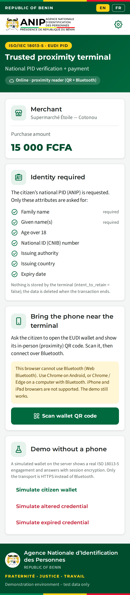
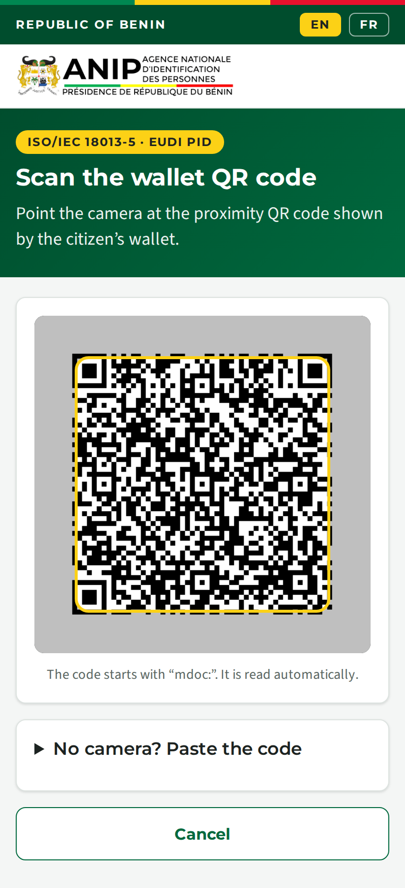
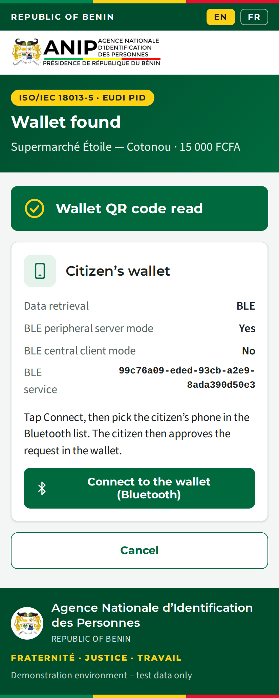
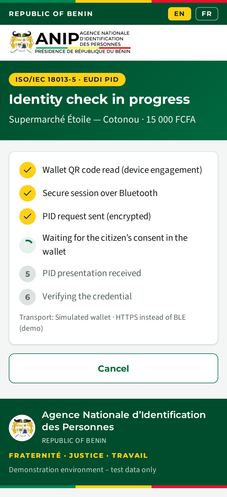
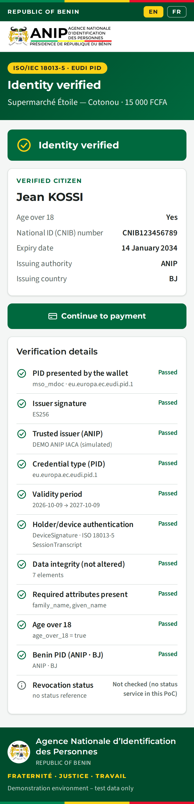
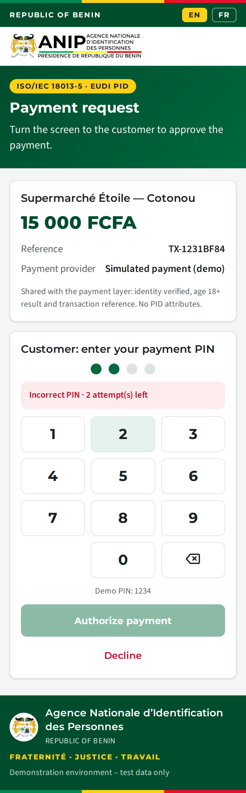
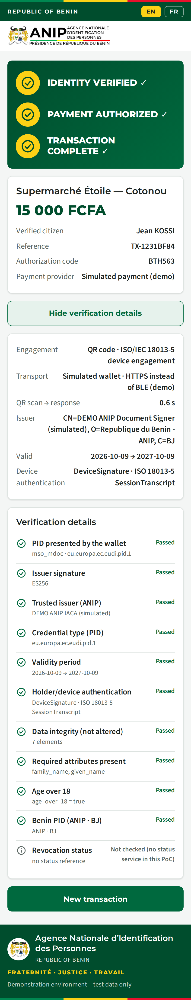
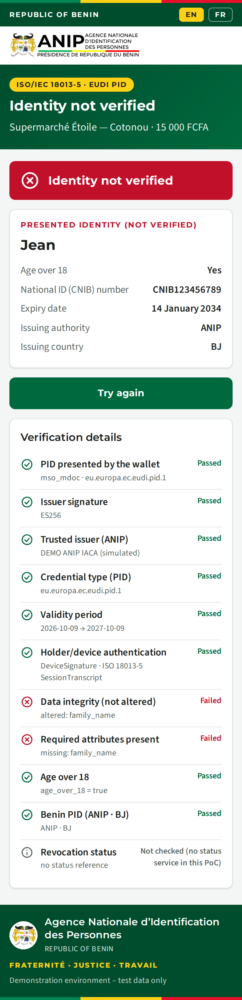
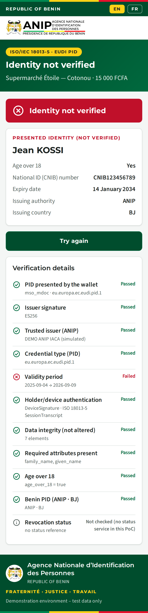
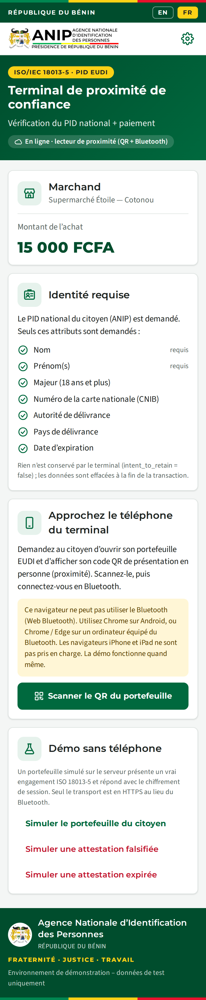

# ANIP Web POS — in-person PID verification (ISO/IEC 18013-5) + payment

**English** · [Français](#terminal-de-proximité-web-anip--vérification-du-pid-en-personne-isoiec-18013-5--paiement)

Web version of the [Android proximity POS](../benin-proximity-pos/), for the same
scenario (*Proximity_PID_Payment_Developer_Requirements*). A citizen pays at the
counter and proves their identity with the **Benin PID mdoc** in their EUDI
wallet using the **ISO/IEC 18013-5 proximity flow**:

1. the wallet shows its proximity QR code (`mdoc:` device engagement);
2. the terminal's camera scans it;
3. the browser connects to the phone over **Bluetooth** (Web Bluetooth);
4. the browser sets up session encryption and requests the PID.

The citizen consents in the wallet, the PID is verified, and the customer
explicitly confirms the payment. No OpenID4VP or internet link between the
wallet and the server is involved: the wallet only talks to the terminal, at
the counter.

It uses the same ANIP / CIVIC branding, screens and checks as the Android app,
is bilingual EN/FR, and deploys on **Render**.

| Home | Scan the wallet QR | Wallet found | Reading | Identity verified |
|---|---|---|---|---|
|  |  |  |  |  |

| Payment | Complete | Altered data rejected | Expired PID | Accueil (FR) |
|---|---|---|---|---|
|  |  |  |  |  |

## The proximity flow

```
 Citizen's wallet (phone)                 Terminal browser (this app)                  Server (Render)
 "Show QR / in person"
 mdoc:<DeviceEngagement>  ──camera──▶  parse engagement (EDeviceKey, BLE UUID)
                                       EReaderKey · ECDH · HKDF → SKReader/SKDevice
 BLE peripheral (advertises UUID) ◀──Web Bluetooth (GATT central)──
                          ◀── SessionEstablishment (encrypted DeviceRequest)
 citizen consents
                          ──▶ SessionData (encrypted DeviceResponse)
                                       decrypt ──── DeviceResponse + SessionTranscript ──▶ verify
                                       result / payment ◀─────────────────────────────── report
```

| ISO/IEC 18013-5 element | Implementation |
|---|---|
| Device engagement | QR code `mdoc:` + base64url(DeviceEngagement), read by the camera (`BarcodeDetector`, or jsQR as fallback), or pasted |
| Session encryption (§9.1.1) | `public/js/mdoc-reader.js` with WebCrypto: P-256 EReaderKey, ECDH, HKDF-SHA256 (`SKReader`/`SKDevice`, salt = SHA-256(SessionTranscriptBytes)), AES-256-GCM with IV = identifier ‖ counter |
| SessionTranscript | `[DeviceEngagementBytes, EReaderKeyBytes, null]` (QR handover) |
| Data retrieval | BLE **mdoc peripheral server mode**: the browser is the GATT central and uses the State / Client2Server / Server2Client / Ident characteristics, with 0x01/0x00 chunking, START and END |
| Device authentication | DeviceSignature (ECDSA) **or** DeviceMac (HMAC-SHA256 with EMacKey from the reader's ephemeral key), over the SessionTranscript |
| Request | DeviceRequest for `eu.europa.ec.eudi.pid.1` with `intent_to_retain = false` |

**Interoperability evidence.** The reader is checked against the **official
ISO/IEC 18013-5 Annex D test vectors** (`test/proximity.test.js`, vectors from
OpenWallet Foundation Multipaz). Its SessionTranscript, SessionEstablishment and
SessionData decryption match the standard byte for byte, and the server
verifies the Annex D DeviceMac. The Web Bluetooth transport was exercised in
Chromium against a GATT peripheral simulator: device filter on the wallet's
service UUID, notifications, START, 20-byte chunked writes, reassembled
response, Ident check, END.

### Browser and wallet requirements

* **Terminal browser:** **Chrome on Android** (6.0+), or Chrome / Edge on Windows,
  macOS or ChromeOS with Bluetooth. Web Bluetooth needs **HTTPS** (Render
  provides it). iPhone and iPad browsers have no Web Bluetooth. Firefox and
  Safari are not supported. On Android, Chrome needs the *Nearby devices*
  (Bluetooth) permission and location turned on.
* **Wallet:** its QR code must offer **BLE mdoc peripheral server mode**. A web
  page can only be a Bluetooth *central*, so it cannot serve wallets that only
  offer *central client mode*. The "Wallet found" screen shows what the wallet
  offers and explains when it is not compatible. In that case use the
  [Android POS](../benin-proximity-pos/), which supports both modes and NFC.
* **Bluetooth write size:** Web Bluetooth does not expose the MTU, so the default
  is 20-byte writes, which work with every phone. It can be raised in Settings.

## Deploy on Render

**Option A: Blueprint.** The repository root contains [`render.yaml`](../render.yaml).

1. In Render, choose **New → Blueprint**, then select `adhopte/EUDIWtest` and the
   branch.
2. Render creates the `anip-web-pos` web service (root directory
   `benin-web-pos`, `npm ci --omit=dev`, `npm start`, health check `/health`).
3. Open `https://<service>.onrender.com` **in Chrome on the terminal device**.

**Option B: manual web service.** Choose **New → Web Service** and set:

| Setting | Value |
|---|---|
| Root Directory | `benin-web-pos` |
| Runtime | Node |
| Build Command | `npm ci --omit=dev` |
| Start Command | `npm start` |
| Health Check Path | `/health` |
| Environment | `NODE_VERSION=22` (optional: `DEMO_MODE`, `DEMO_PIN`, `BLE_CHUNK_SIZE`) |

No URL needs configuring: the wallet never contacts the server.

> **Free plan:** the service sleeps after ~15 minutes without traffic, and the
> first request then takes about a minute. Open the page before the citizen
> arrives. Sales are kept in memory for 15 minutes.

## Using it at the counter

1. **Home**: merchant, amount (e.g. 15 000 FCFA), the requested PID attributes
   and **Scan wallet QR code**.
2. The citizen opens the wallet's in-person / "Show QR" screen. The terminal's
   camera reads the code automatically (or paste the `mdoc:` text).
3. **Wallet found** shows the wallet's retrieval options. Tap **Connect to the
   wallet (Bluetooth)** and pick the phone in Chrome's Bluetooth list.
4. The steps update live: secure session, PID request sent, waiting for consent,
   presentation received, verifying.
5. **Result**: identity verified (or the failing checks). Then **Payment**: the
   customer enters the PIN. Then **Final screen**:
   `IDENTITY VERIFIED ✓ / PAYMENT AUTHORIZED ✓ / TRANSACTION COMPLETE ✓`.

**Demo without a phone:** a simulated wallet on the server publishes a real
engagement and answers the encrypted request. The same reader code and server
verification run; only the transport is HTTPS instead of BLE. The demo has
genuine, altered and expired PIDs.

## Requested attributes (Benin PID Rulebook v1.1)

`family_name` and `given_name` are required. `age_over_18`, `document_number`,
`issuing_authority`, `issuing_country` and `expiry_date` are also requested. The
portrait is optional (Settings) and off by default. `birth_date`, the address
and the NPI are **not** requested. `intent_to_retain = false` for every element.

## Verification checks (server)

Same list as the Android app ([`src/report.js`](src/report.js)):

| Check | How |
|---|---|
| PID presented | DeviceResponse decrypted by the reader and decoded |
| Issuer signature | MSO `COSE_Sign1` against the DS certificate in `x5chain` |
| Trusted issuer (ANIP) | Chain to an anchor in `trust/`. **FAIL** when *Require a trusted issuer* is on (default), **WARN** otherwise |
| Credential type | docType `eu.europa.ec.eudi.pid.1` |
| Validity period | MSO `validFrom ≤ now ≤ validUntil` |
| Holder/device authentication | DeviceSignature or DeviceMac over **this session's** SessionTranscript |
| Data integrity | The digest of each element matches the MSO, so **altered data fails** |
| Required attributes, age 18+ | Names present; `age_over_18` when *Require age 18+* is on |
| Benin PID | `issuing_country = BJ` (warning otherwise) |
| Revocation | **Not checked**: this PoC has no status-list service. It is reported as such, never simulated |

**Replay protection:** every session uses a fresh EReaderKey, so the server
refuses a SessionTranscript it has already seen. A response presented with
another session's transcript fails device authentication.

## Payment boundary

[`src/payment.js`](src/payment.js): a gateway has `displayName` and
`authorize(request, { pin })`. It receives only the reference, merchant, amount,
currency and `{ identityVerified, ageOver18 }`. **No name, document number or
portrait** is sent. The simulated gateway uses `DEMO_PIN` (default `1234`) with
3 attempts and is labelled "Simulated payment (demo)". Replace it in
`server.js` with a real acquirer or mobile-money client.

## Trust anchors

Put the **ANIP IACA** PEM in [`trust/`](trust/README.md). Until you have it, a
real wallet's PID fails *Trusted issuer*. To test, either turn off *Require a
trusted issuer* in Settings (the check becomes a warning), or tap **Trust this
issuer (demo)** on the result screen. That adds the presented issuer
certificate in memory until the server restarts, and is for testing only.

## Run locally and test

```bash
cd benin-web-pos
npm install
npm start      # http://localhost:3000 (camera and Web Bluetooth work on localhost)
npm test       # 17 tests: ISO Annex D vectors, proximity session, checks, tampering, replay, MAC, payment
```

## Project layout

```
public/js/mdoc-reader.js  ISO 18013-5 reader: engagement, session encryption, DeviceRequest, Web Bluetooth GATT
public/js/cbor.js         small CBOR codec (browser + Node)
public/js/app.js          terminal UI (camera scan, connect, steps, result, payment), EN/FR in i18n.js
server.js                 verification API, sales/payment, demo wallet endpoints
src/verify/mdoc.js        DeviceResponse verification (issuer auth, digests, validity, DeviceSignature/DeviceMac)
src/report.js             check list (same as the Android PidVerifier)
src/payment.js            payment gateway boundary + simulated gateway
src/demo/wallet.js        simulated ANIP issuer + wallet acting as an mdoc (genuine / altered / expired)
test/                     node:test suites + ISO Annex D vectors
```

## Status and limits

* The protocol is verified against the ISO test vectors, and the BLE transport
  against a GATT simulator. **It has not yet been tried with a real wallet on a
  phone**, including SIGMA. The wallet must offer BLE peripheral server mode
  (see above).
* NFC engagement is not available in browsers (use the Android POS). Reader
  authentication (ReaderAuth) is not sent.
* The ANIP IACA is not bundled, payment is simulated, and revocation is not
  checked.

---

# Terminal de proximité web ANIP — vérification du PID en personne (ISO/IEC 18013-5) + paiement

[English](#anip-web-pos--in-person-pid-verification-isoiec-18013-5--paiement) · **Français**

Version web du [terminal de proximité Android](../benin-proximity-pos/), pour le
même scénario, avec le **flux de proximité ISO/IEC 18013-5** :

1. le portefeuille affiche son code QR de proximité (`mdoc:`) ;
2. la caméra du terminal le lit ;
3. le navigateur se connecte au téléphone en **Bluetooth** (Web Bluetooth) ;
4. le navigateur établit le chiffrement de session et demande le **PID mdoc du Bénin**.

Le citoyen consent dans son portefeuille, le serveur vérifie le PID, puis le
client confirme le paiement. Il n'y a ni OpenID4VP ni échange entre le
portefeuille et le serveur : tout se passe au comptoir.

## Déploiement sur Render

**Blueprint :** choisissez **New → Blueprint**, puis le dépôt `adhopte/EUDIWtest`
et la branche ([`render.yaml`](../render.yaml)).

**Service manuel :**

| Paramètre | Valeur |
|---|---|
| Root Directory | `benin-web-pos` |
| Build Command | `npm ci --omit=dev` |
| Start Command | `npm start` |
| Health Check Path | `/health` |

Ouvrez ensuite l'URL `https://…onrender.com` **dans Chrome sur l'appareil du
terminal**.

## Prérequis

* **Navigateur du terminal :** Chrome sur Android, ou Chrome / Edge sur
  Windows, macOS ou ChromeOS avec Bluetooth, en **HTTPS**. Les iPhone et iPad
  ne sont pas pris en charge (pas de Web Bluetooth).
* **Portefeuille :** son QR doit proposer le **mode serveur périphérique BLE**.
  Une page web ne peut être que *central* Bluetooth. Sinon, utilisez le terminal
  Android (les deux modes, plus le NFC).

## Au comptoir

1. **Scanner le QR du portefeuille** : la caméra lit le code `mdoc:` (ou collez-le).
2. **Portefeuille détecté** : touchez **Connecter le portefeuille (Bluetooth)**,
   puis choisissez le téléphone.
3. Session sécurisée, demande envoyée, consentement, réception, vérification.
4. Résultat, puis paiement par PIN, puis
   `IDENTITÉ VÉRIFIÉE ✓ / PAIEMENT AUTORISÉ ✓ / TRANSACTION TERMINÉE ✓`.

**Démo sans téléphone :** un portefeuille simulé sur le serveur répond avec un
vrai engagement et le chiffrement de session (PID authentique, falsifié ou
expiré). Seul le transport est en HTTPS au lieu du BLE.

## Points clés

* **Conformité :** le lecteur est vérifié avec les **vecteurs de test officiels de
  l'annexe D d'ISO/IEC 18013-5** (correspondance octet par octet), et le
  transport Web Bluetooth avec un simulateur de périphérique GATT.
* **Contrôles :**
  * signature de l'émetteur et émetteur de confiance ;
  * type et validité ;
  * authentification de l'appareil (DeviceSignature ou DeviceMac) sur la
    SessionTranscript de **cette** session ;
  * intégrité (**une donnée modifiée échoue**) ;
  * attributs requis, majorité et pays BJ ;
  * refus des sessions rejouées.

  La **révocation n'est pas vérifiée** et c'est indiqué comme tel.
* **Paiement :** l'interface `PaymentGateway` est remplaçable. Seuls la
  référence, le montant et `{identityVerified, ageOver18}` sont transmis. Le
  paiement simulé utilise le PIN `1234`.
* **Ancres de confiance :** placez l'IACA ANIP dans `trust/`. Pour tester avec un
  vrai portefeuille avant cela, utilisez « Faire confiance à cet émetteur (démo) »
  ou désactivez l'exigence dans les paramètres.

## Limites

Le terminal n'a pas encore été testé sur téléphone avec un vrai portefeuille
(SIGMA compris). L'engagement NFC n'est pas possible dans un navigateur, et
l'authentification du lecteur n'est pas envoyée. L'IACA ANIP n'est pas fournie,
le paiement est simulé et la révocation n'est pas vérifiée.
