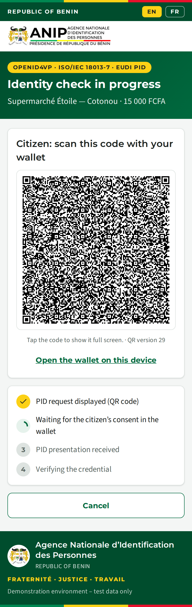
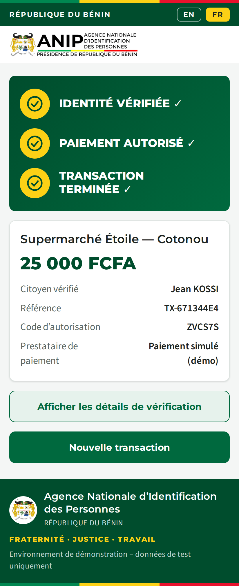
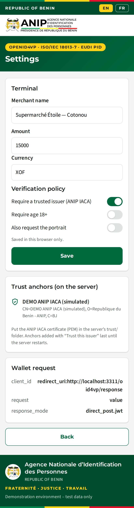

# ANIP Web POS — PID verification by QR code + payment

**English** · [Français](#terminal-de-vente-web-anip--vérification-du-pid-par-code-qr--paiement)

Web version of the [Android proximity POS](../benin-proximity-pos/), for the same
scenario (*Proximity_PID_Payment_Developer_Requirements*). A citizen pays at the
counter and proves their identity with the **Benin PID mdoc** in their EUDI
wallet. The terminal shows a **QR code**, the citizen scans it with the wallet and
consents, the terminal verifies the PID, and the customer then explicitly
confirms the payment. It uses the same ANIP / CIVIC branding as the Android app,
the same screens and checks, and is bilingual EN/FR. It runs in any browser
(tablet, laptop or phone) and deploys on **Render**.

| Home | QR code | Identity verified | Payment | Complete |
|---|---|---|---|---|
|  |  |  |  |  |

| Altered data rejected | Expired PID | Accueil (FR) | Terminé (FR) | Settings |
|---|---|---|---|---|
|  |  |  |  |  |

## Deploy on Render

**Option A: Blueprint (one click).** The repository root contains
[`render.yaml`](../render.yaml).

1. In Render, choose **New → Blueprint** and connect the `adhopte/EUDIWtest`
   repository and the branch to deploy.
2. Render creates the `anip-web-pos` web service (root directory `benin-web-pos`,
   `npm ci --omit=dev`, `npm start`, health check `/health`).
3. Open `https://<service>.onrender.com`. Nothing else needs configuring: the
   public URL used in the wallet request (`client_id`, `response_uri`) is read
   from Render's `RENDER_EXTERNAL_URL`.

**Option B: manual web service.** Choose **New → Web Service** on the same
repository, then set:

| Setting | Value |
|---|---|
| Root Directory | `benin-web-pos` |
| Runtime | Node |
| Build Command | `npm ci --omit=dev` |
| Start Command | `npm start` |
| Health Check Path | `/health` |
| Environment | `NODE_VERSION=22` (optional: `DEMO_PIN`, `DEMO_MODE`) |

Check the deployment: `https://<service>.onrender.com/health` should show your
`https://…onrender.com/oid4vp/response` as `responseUri`.

> **Free plan:** the service sleeps after ~15 minutes without traffic. The first
> request then takes about a minute. Open the page *before* the citizen
> scans. Transactions live in memory (10 minutes) and are lost on restart, which
> is fine for a PoC.

## Scenario

1. **Home**: merchant, amount (e.g. 15 000 FCFA), "identity required", the list
   of requested PID attributes, and a **Show QR code** button.
2. **QR code**: the terminal displays an OpenID4VP request (tap it to show it full
   screen). The citizen scans it with the wallet (e.g. SIGMA). The progress steps
   update live.
3. **Consent**: the wallet shows what is requested and the citizen approves. The
   wallet sends the PID **encrypted** to the terminal's server.
4. **Verification**: the result screen shows the presented identity and the full
   check list.
5. **Payment**: only after the identity is verified. The customer confirms with a
   PIN on the terminal.
6. **Final screen**: `IDENTITY VERIFIED ✓ / PAYMENT AUTHORIZED ✓ / TRANSACTION COMPLETE ✓`,
   with the reference, authorization code and an expandable verification report.

"Demo without a phone" runs the same flow with a simulated ANIP issuer and wallet
on the server: genuine PID, altered data, and expired PID.

## How the QR proximity flow works

```
Terminal (browser)          POS server (Render)                    Citizen's wallet
 Show QR code ───────────▶ create transaction + P-256 key
              ◀─────────── QR: openid4vp://?…dcql_query…
 polls /api/tx/:id                                     ◀──scan──── reads request
                                                                    consent
                           POST /oid4vp/response  ◀─────────────── JWE(vp_token)
                           decrypt · verify mdoc · report
 result / payment ◀───────
```

* **Request** ([`src/oid4vp.js`](src/oid4vp.js)): OpenID4VP with a DCQL query for
  `mso_mdoc` / `eu.europa.ec.eudi.pid.1`. It is by value, so the whole request is
  in the QR code (version ~29), with `client_id=redirect_uri:<BASE_URL>/oid4vp/response`
  and `response_mode=direct_post.jwt`. This is the profile the SIGMA wallet
  (HAIP, EU reference library) accepts without a verifier certificate: with the
  [Benin eServices PoC](../Benin%20poc/), SIGMA showed its consent screen and
  returned the encrypted PID response.
* **Binding**: each transaction gets a fresh nonce, state and ECDH-ES key. The
  mdoc DeviceAuth is verified over the OpenID4VP SessionTranscript, which
  includes the client_id, nonce, response_uri and this key's JWK thumbprint. A
  presentation made for another terminal or session therefore fails.
* **Why not BLE in the browser:** ISO 18013-5 BLE needs Bluetooth access that
  web pages don't have reliably (and not at all on iOS). The ISO 18013-7 /
  OpenID4VP QR flow gives the same in-person result with only a camera on the
  wallet side. Use the [Android POS](../benin-proximity-pos/) for offline
  NFC/BLE.

## Requested attributes (Benin PID Rulebook v1.1)

`family_name` and `given_name` are required. `age_over_18`, `document_number`,
`issuing_authority`, `issuing_country` and `expiry_date` are also requested. The
portrait is optional (Settings) and off by default. `birth_date`, the address and
the NPI are **not** requested.

DCQL `claim_sets` let a PID that lacks some optional attributes still match;
the POS then reports what is missing. `DCQL_CLAIM_SETS=false` makes every
attribute mandatory and gives a smaller QR code (version 27).

## Verification checks

Same list as the Android app ([`src/report.js`](src/report.js)):

| Check | How |
|---|---|
| PID presented | Response decrypted (JWE ECDH-ES/A128GCM) and DeviceResponse decoded |
| Issuer signature | MSO `COSE_Sign1` against the DS certificate in `x5chain` |
| Trusted issuer (ANIP) | Chain to an anchor in `trust/`. **FAIL** when *Require a trusted issuer* is on (default), **WARN** otherwise |
| Credential type | docType `eu.europa.ec.eudi.pid.1` |
| Validity period | MSO `validFrom ≤ now ≤ validUntil` |
| Holder/device authentication | DeviceSignature over the SessionTranscript |
| Data integrity | The digest of each disclosed element matches the MSO, so **altered data fails** |
| Required attributes | Names present |
| Age over 18 | `age_over_18`; mandatory if *Require age 18+* is on |
| Benin PID | `issuing_country = BJ` (warning otherwise) |
| Revocation | **Not checked**: this PoC has no status-list service. Reported as such, never simulated |

The identity is verified when no check fails. Otherwise payment is not offered.

## Payment boundary

[`src/payment.js`](src/payment.js): a gateway has `displayName` and
`authorize(request, { pin })`. It receives only the reference, merchant, amount,
currency and `{ identityVerified, ageOver18 }`. **No name, document number or
portrait** is sent. `SimulatedPaymentGateway` uses `DEMO_PIN` (default `1234`),
allows 3 attempts and returns a 6-character authorization code. It is clearly
labelled "Simulated payment (demo)". Replace it in `server.js` with a real
acquirer or mobile-money client.

## Trust anchors and SIGMA

* Put the **ANIP IACA** PEM in [`trust/`](trust/README.md) for real wallets.
* Until you have it, a SIGMA PID fails *Trusted issuer*. Either turn off
  *Require a trusted issuer* in Settings (it becomes a warning), or tap **Trust
  this issuer (demo)** on the result screen. That adds the presented issuer
  certificate (in memory, until restart) so the next scan passes. It is for
  testing only.
* Settings (merchant, amount, policy) are stored per browser.

## Configuration

See [`.env.example`](.env.example). The main variables are `BASE_URL` (auto on
Render), `REQUEST_MODE`, `CLIENT_ID`, `RESPONSE_MODE`, `DCQL_CLAIM_SETS`,
`TRUST_DIR`, `DEMO_MODE`, `DEMO_PIN` and `PIN_ATTEMPTS`.

## Run locally and test

```bash
cd benin-web-pos
npm install
npm start            # http://localhost:3000 (demo mode works locally)
npm test             # 13 tests: request shape, checks, tampering, replay, payment, access control
```

A real wallet must reach `response_uri`, so test with a phone against the Render
URL (or an ngrok tunnel with `BASE_URL=https://…ngrok…`).

## Project layout

```
server.js               Express: terminal API, wallet endpoints, static UI
src/oid4vp.js           OpenID4VP request (QR), encrypted response handling
src/report.js           check list (same as the Android PidVerifier)
src/payment.js          payment gateway boundary + simulated gateway
src/demo/wallet.js      simulated ANIP issuer + wallet (genuine / altered / expired)
src/verify/             mdoc, JOSE/JWE and trust code shared with "Benin poc"
public/                 terminal UI (vanilla JS, ANIP theme, EN/FR)
test/pos.test.js        node:test suite
```

## Status and limits

* Verification, tampering, replay and the payment flow are tested with the
  simulated wallet. The request profile is the one SIGMA accepts in the Benin
  eServices PoC, but **this POS has not yet been tried with SIGMA**.
* The ANIP IACA is not bundled. Payment is simulated, revocation is not checked,
  and requests are unsigned (HAIP production needs a verifier certificate and
  signed request objects).

---

# Terminal de vente web ANIP — vérification du PID par code QR + paiement

[English](#anip-web-pos--pid-verification-by-qr-code--payment) · **Français**

Version web du [terminal de proximité Android](../benin-proximity-pos/), pour le
même scénario. Le terminal affiche un **code QR**, le citoyen le scanne avec son
portefeuille EUDI et consent, le terminal vérifie le **PID mdoc du Bénin**, puis le
client confirme explicitement le paiement. L'application reprend l'identité
visuelle ANIP / CIVIC, les mêmes écrans et contrôles, et est bilingue FR/EN.

## Déploiement sur Render

**Option A : Blueprint.** Dans Render, choisissez **New → Blueprint**, puis le dépôt
`adhopte/EUDIWtest` et la branche. Le fichier [`render.yaml`](../render.yaml) crée
le service `anip-web-pos`. L'URL publique est lue automatiquement depuis
`RENDER_EXTERNAL_URL` : aucune configuration n'est nécessaire.

**Option B : service web manuel.**

| Paramètre | Valeur |
|---|---|
| Root Directory | `benin-web-pos` |
| Build Command | `npm ci --omit=dev` |
| Start Command | `npm start` |
| Health Check Path | `/health` |
| Environnement | `NODE_VERSION=22` |

Sur l'offre gratuite, le service se met en veille après ~15 minutes : ouvrez la
page avant que le citoyen scanne.

## Déroulement

1. **Accueil** : marchand, montant, attributs PID demandés, bouton **Afficher le code QR**.
2. **Code QR** : le citoyen le scanne avec son portefeuille (ex. SIGMA). Touchez le
   code pour l'afficher en plein écran.
3. **Consentement** dans le portefeuille ; la réponse arrive **chiffrée** sur le serveur.
4. **Vérification** : identité présentée et liste des contrôles.
5. **Paiement** (uniquement si l'identité est vérifiée) : le client saisit son PIN.
6. **Écran final** : `IDENTITÉ VÉRIFIÉE ✓ / PAIEMENT AUTORISÉ ✓ / TRANSACTION TERMINÉE ✓`.

« Démo sans téléphone » : PID authentique, données modifiées, PID expiré, avec
un émetteur et un portefeuille ANIP simulés sur le serveur.

## Points clés

* **Demande** : OpenID4VP + DCQL (`mso_mdoc`, `eu.europa.ec.eudi.pid.1`), par
  valeur dans le QR (version ~29), `client_id=redirect_uri:…`, réponse chiffrée
  (`direct_post.jwt`). C'est le profil accepté par SIGMA dans le PoC eServices
  (écran de consentement affiché et réponse chiffrée envoyée).
* **Attributs** : nom et prénom (requis), majorité, numéro CNIB, autorité et
  pays de délivrance, date d'expiration. La photo est optionnelle. Ni date de
  naissance, ni adresse, ni NPI.
* **Contrôles** : signature de l'émetteur, émetteur de confiance, type, validité,
  authentification de l'appareil, intégrité (**une donnée modifiée échoue**),
  attributs requis, majorité et pays BJ. La **révocation n'est pas vérifiée**
  (pas de service de statut dans ce PoC) et c'est indiqué comme tel.
* **Paiement** : interface `PaymentGateway` remplaçable. Seuls la référence, le
  montant et `{identityVerified, ageOver18}` sont transmis. Le paiement simulé
  (PIN `1234`, 3 essais) est identifié comme démo.
* **Ancres de confiance** : placez l'IACA ANIP dans `trust/`. Pour tester SIGMA
  avant cela, désactivez *Exiger un émetteur de confiance* ou utilisez **Faire
  confiance à cet émetteur (démo)**.
* **Pourquoi pas le BLE dans le navigateur** : les pages web n'ont pas un accès
  Bluetooth fiable (aucun sur iOS). Le flux QR ISO 18013-7 / OpenID4VP donne le
  même résultat en présentiel. Pour le mode hors ligne NFC/BLE, utilisez le
  terminal Android.

## Exécution locale

```bash
cd benin-web-pos && npm install && npm start   # http://localhost:3000
npm test                                       # 13 tests
```

## Limites

Le terminal n'a pas encore été testé avec SIGMA. L'IACA ANIP n'est pas
fournie. Le paiement est simulé, la révocation n'est pas vérifiée, et les
demandes ne sont pas signées (la mise en production HAIP nécessite un certificat
vérificateur).
